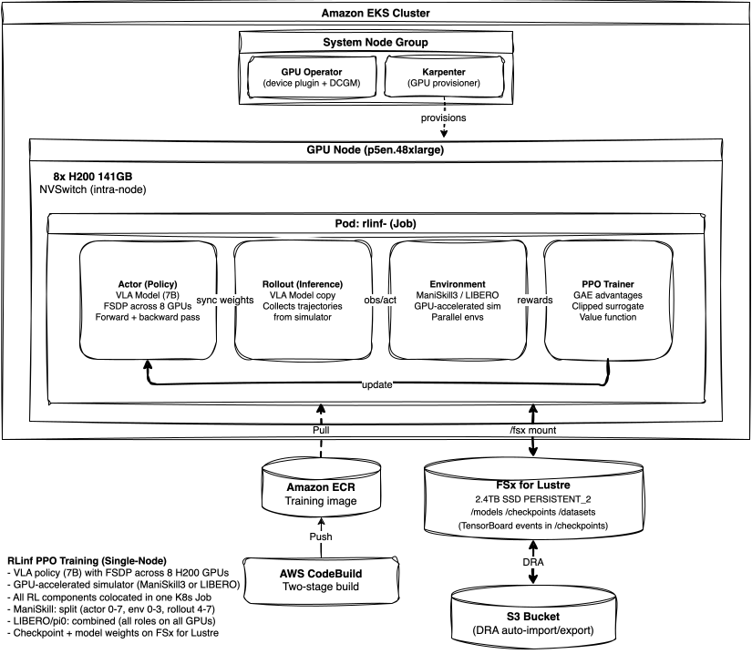
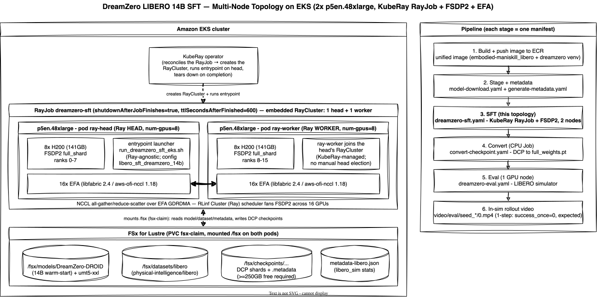

<!-- Copyright Amazon.com, Inc. or its affiliates. All Rights Reserved. -->
<!-- SPDX-License-Identifier: MIT-0 -->

# RLinf-on-EKS

**Prescriptive Deployment of the RLinf Framework on Amazon EKS for Embodied and Agentic AI**

Deploy [RLinf](https://github.com/RLinf/RLinf) reinforcement learning (RL) workloads on Amazon Elastic Kubernetes Service (EKS).

RLinf-on-EKS is a skills-based framework that provides working, prescriptive deployments of the RLinf RL infrastructure on GPU (Graphics Processing Unit)-accelerated Kubernetes. An AI agent uses prescriptive [skills](.opencode/skills/) to provision infrastructure, build containers, and validate the training pipeline end-to-end.

---

## About RLinf

[RLinf](https://github.com/RLinf/RLinf) (v0.3, 3k+ GitHub stars) is a flexible and scalable open-source RL infrastructure for Embodied and Agentic AI. Key capabilities:

- **RL Algorithms**: GRPO (Group Relative Policy Optimization), PPO, DAPO, SAC (Soft Actor-Critic), CrossQ, RLPD, SAC-Flow, DSRL, DAgger
- **Simulators**: ManiSkill, LIBERO, RoboTwin, CALVIN, RoboCasa, IsaacLab, MetaWorld, BEHAVIOR
- **Models**: OpenVLA, OpenVLA-OFT, pi0, pi0.5, GR00T, StarVLA, LingBot-VLA, Dexbotic
- **Backends**: FSDP (Fully Sharded Data Parallel) + HuggingFace/SGLang/vLLM, Megatron + SGLang/vLLM
- **Architecture**: Macro-to-micro flow transformation achieves up to 2.434x throughput

Papers: [RLinf System](https://arxiv.org/abs/2509.15965), [RLinf-VLA](https://arxiv.org/abs/2510.06710) | Docs: [rlinf.readthedocs.io](https://rlinf.readthedocs.io/en/latest/)

---

## Architecture

### Single-Node PPO Training (ManiSkill / LIBERO (Lifelong Embodied Robot Operation))



Karpenter provisions a single p5en.48xlarge GPU node on-demand when the training Job is submitted. The pod pulls its container image from ECR (built via CodeBuild's two-stage process) and mounts FSx for Lustre to access pre-trained model weights and write checkpoints. All RL components — actor, rollout, environment, and PPO trainer — run colocated inside a single pod with 8 H200 GPUs allocated via the GPU Operator's device plugin. The actor model occupies GPUs 0-7, rollout inference runs on GPUs 4-7, and the GPU-accelerated ManiSkill3 simulator shares GPUs 0-3 with environment workers. This split maximizes throughput by overlapping simulation rendering with rollout inference on separate GPU subsets. For LIBERO (CPU-based MuJoCo rendering), all components share GPUs 0-7 in a combined placement instead.

### Multi-Node SFT (Supervised Fine-Tuning) (DreamZero)



Training runs on two p5en.48xlarge nodes (16x H200 GPUs total) provisioned by Karpenter. A 2-replica StatefulSet with a headless Service provides DNS-based rendezvous for `torchrun` — ordinal 0 acts as the master and ordinal 1 joins as a worker. Each pod launches 8 GPU ranks (16 total). DeepSpeed ZeRO-2 with CPU offload shards optimizer state across all ranks while keeping model parameters replicated; gradient synchronization flows through NCCL over EFA RDMA using all 16 EFA interfaces per node. Both pods mount a shared 2.4 TiB FSx for Lustre filesystem holding model weights, the DROID dataset, and checkpoints. FSx is backed by an S3 bucket via a Data Repository Association that auto-imports new objects and auto-exports checkpoint writes.

> Infrastructure layer details: [infrastructure/README.md](infrastructure/README.md)  
> DreamZero model architecture: [examples/dreamzero/README.md](examples/dreamzero/README.md#architecture)

---

## Quick Start: Deploy RLinf ManiSkill PPO

Deploy the [RLinf](https://github.com/RLinf/RLinf) ManiSkill PPO (Proximal Policy Optimization) example ([PPO training of OpenVLA-OFT on ManiSkill3](examples/maniskill-openvlaoft-ppo/README.md)) in 6 steps.

### Prerequisites

- AWS account with [GPU capacity](#gpu-capacity)
- [Terraform state bucket](#terraform-state-backend) created
- [Terraform](https://developer.hashicorp.com/terraform/install) >= 1.5.0
- [AWS CLI (Command Line Interface) v2](https://docs.aws.amazon.com/cli/latest/userguide/install-cliv2.html) configured
- [kubectl](https://kubernetes.io/docs/tasks/tools/) >= 1.35

> See [Prerequisites and Setup](#prerequisites-and-setup) for full software versions and setup instructions.

### Steps

```bash
# 1. Clone and configure
git clone https://github.com/aws-samples/sample-rlinf-on-eks.git && cd sample-rlinf-on-eks

# Configure GPU instance type and Availability Zone.
# Set these to match your Capacity Block reservation (see "GPU Capacity" below).
cat > infrastructure/cluster/terraform.tfvars <<EOF
region    = "us-east-1"
target_az = "us-east-1b"  # AZ of your Capacity Block reservation
EOF

cat > infrastructure/workloads/terraform.tfvars <<EOF
gpu_instance_types = ["p5.48xlarge"]  # Your reserved instance type
capacity_type      = ["reserved", "on-demand"]  # reserved = Capacity Block; on-demand = fallback
gpu_limit          = 64                         # 8 GPUs × max nodes

# Capacity Block reservation selector (required for reserved capacity type)
# Find your reservation ID in the EC2 console under Capacity Reservations.
capacity_reservation_selector = [
  { id = "cr-0123456789abcdef0" }  # Replace with your Capacity Block reservation ID
]
EOF

# 2. Provision infrastructure (~20 min)
./infrastructure/deploy.sh --action apply --layer all
$(terraform -chdir=infrastructure/cluster output -raw configure_kubectl)

# 3. Build and push container image (~15 min via CodeBuild)
zip -r rlinf-on-eks.zip examples/Dockerfile examples/buildspec.yml examples/scripts/
aws s3 cp rlinf-on-eks.zip s3://$(terraform -chdir=infrastructure/build output -raw codebuild_source_bucket)/rlinf-on-eks.zip
BUILD_ID=$(aws codebuild start-build --project-name $(terraform -chdir=infrastructure/build output -raw codebuild_project_name) --query 'build.id' --output text)
echo "Build started: $BUILD_ID"
aws codebuild batch-get-builds --ids "$BUILD_ID" --query 'builds[0].buildStatus' --output text
# Poll until SUCCEEDED: watch -n30 "aws codebuild batch-get-builds --ids $BUILD_ID --query 'builds[0].buildStatus' --output text"

# 4. Stage model weights (per-example)
export NAMESPACE=rlinf
envsubst '${NAMESPACE}' < examples/maniskill-openvlaoft-ppo/manifests/model-download.yaml | kubectl apply -f -
kubectl logs -f job/model-download-maniskill-openvlaoft -n $NAMESPACE

# 5. Validate container
export ECR_URI=$(terraform -chdir=infrastructure/build output -raw ecr_repository_url)
envsubst < infrastructure/manifests/container-test.yaml | kubectl apply -f -
kubectl logs -f job/container-test -n rlinf

# 6. Launch training
envsubst < examples/maniskill-openvlaoft-ppo/manifests/maniskill-openvlaoft-ppo.yaml | kubectl apply -f -
kubectl logs -f job/rlinf-maniskill-openvlaoft -n rlinf
```
### Teardown

```bash
# Delete training job
kubectl delete job rlinf-maniskill-openvlaoft -n rlinf

# Full teardown (destroys everything in reverse layer order)
./infrastructure/deploy.sh --action destroy --layer all
```
---

## Training Examples

| Example | Framework | Target | GPU Requirement | Status |
|---------|-----------|--------|-----------------|--------|
| [ManiSkill+OpenVLA-OFT PPO](examples/maniskill-openvlaoft-ppo/) | RLinf v0.3 | ManiSkill + OpenVLA-OFT PPO | p5en.48xlarge (8x H200 141GB) | Validated |
| [Wan World Model GRPO](examples/wan-openvlaoft-grpo/) | RLinf v0.3 | Wan world model (LIBERO) + OpenVLA-OFT GRPO | p5en.48xlarge (8x H200 141GB) | Validated |
| [LIBERO+Pi0 PPO](examples/libero-pi0-ppo/) | RLinf v0.3 | LIBERO Spatial + pi0 PPO | p5en.48xlarge (8x H200 141GB) | Validated |
| [DreamZero SFT](examples/dreamzero/) | RLinf v0.3 | LIBERO + DreamZero 14B WAM SFT | 2x p5en.48xlarge (16x H200 141GB) | Validated |

---

## Repository Structure

```
rlinf-on-eks/
├── AGENTS.md                        # Agent system instructions: thesis, skills index
├── README.md                        # This file: human-facing documentation
├── validate.sh                      # Validation harness: local checks + cluster L0-L6
├── infrastructure/                  # Layered Terraform (5 layers, orchestrated by deploy.sh)
│   ├── README.md                    #   Layer descriptions, deploy.sh usage
│   ├── AGENTS.md                    #   Terraform gotchas, provider quirks
│   ├── deploy.sh                    #   Orchestrates all layers in order
│   ├── cluster/                     #   VPC, EKS, system nodes, IAM (Identity and Access Management)
│   ├── storage/                     #   FSx for Lustre, S3, PV/PVC
│   ├── addons/                      #   Karpenter, GPU Operator, Prometheus, MLflow, KubeRay
│   ├── workloads/                   #   Karpenter NodePool/EC2NodeClass, ResourceQuota, LimitRange
│   ├── build/                       #   ECR (Elastic Container Registry) repository + CodeBuild project
│   └── manifests/                   #   Validation manifests (smoke test, container test, NCCL, topology)

├── examples/                        # RLinf training examples, Dockerfile, buildspec, manifests
│   ├── README.md                    #   Framework details, compute, quick start, DreamZero results
│   ├── AGENTS.md                    #   RLinf-specific gotchas, dependency pins, GPU sizing
│   ├── Dockerfile                   #   Container image (DLC base + RLinf + ManiSkill)
│   ├── buildspec.yml                #   CodeBuild build specification
│   └── scripts/                     #   Training launch, inference, composition scripts
├── tests/lib/                       # Validation libraries sourced by validate.sh
└── .opencode/skills/                # Deployment skills (14 shared + 5 rlinf-*)
```
---

## Prerequisites and Setup

### Software

| Tool | Version | Install | Required for |
|------|---------|---------|--------------|
| Terraform | >= 1.5.0 | https://developer.hashicorp.com/terraform/install | All steps |
| AWS CLI | v2 | https://docs.aws.amazon.com/cli/latest/userguide/install-cliv2.html | All steps |
| kubectl | >= 1.35 | https://kubernetes.io/docs/tasks/tools/ | Steps 4-6 |
| Docker | Latest | https://docs.docker.com/get-docker/ | Local builds (alternative to CodeBuild) |
| Helm | >= 3.x | https://helm.sh/docs/intro/install/ | Troubleshooting only (Terraform manages Helm releases) |

### GPU Capacity

P-class GPU instances (p4d, p5, p5en) have limited availability. In most regions you will need to purchase a [Capacity Block for ML (Machine Learning)](https://docs.aws.amazon.com/AWSEC2/latest/UserGuide/capacity-blocks-using.html) to guarantee access to GPU nodes. You must also have sufficient [service quotas](https://docs.aws.amazon.com/servicequotas/latest/userguide/intro.html) for the instance type you intend to use.

The tfvars files created in Step 1 configure Karpenter to provision nodes from your Capacity Block. The `target_az` ensures the VPC subnet, FSx filesystem, system nodes, and GPU nodes all deploy in the same Availability Zone as your reserved capacity.

| Variable | File | Purpose |
|----------|------|---------|
| `target_az` | `infrastructure/cluster/terraform.tfvars` | AZ of your reservation — all resources co-locate here |
| `gpu_instance_types` | `infrastructure/workloads/terraform.tfvars` | Instance type(s) to provision |
| `capacity_type` | `infrastructure/workloads/terraform.tfvars` | `["reserved", "on-demand"]` for Capacity Blocks with fallback, or `["on-demand"]` |
| `capacity_reservation_selector` | `infrastructure/workloads/terraform.tfvars` | Capacity Block reservation ID or tags (required when using `reserved`) |
| `gpu_limit` | `infrastructure/workloads/terraform.tfvars` | Max total GPUs (cost guard) |

Karpenter uses `reserved` capacity type for both Capacity Blocks and ODCRs. It prioritizes reserved capacity and falls back to on-demand when reservations are exhausted. The `ReservedCapacity` feature gate is enabled by default in Karpenter >= v1.6.

**Without tfvars** (defaults): Karpenter selects the cheapest available instance from the g5, g6, and g6e families on-demand. Suitable for infrastructure validation but not production training.

### Terraform State Backend

All five infrastructure layers store state in a shared S3 bucket with separate keys per layer (e.g., `cluster/terraform.tfstate`, `storage/terraform.tfstate`). Create this bucket before running `deploy.sh`:

```bash
aws s3api create-bucket \
  --bucket rlinf-on-eks-terraform-state \
  --region us-east-1
  
aws s3api put-bucket-versioning \
  --bucket rlinf-on-eks-terraform-state \
  --versioning-configuration Status=Enabled
```

After creating the bucket, update the `backend "s3"` block in each layer's `versions.tf` to match your bucket name and region. State locking uses Terraform's native S3 lockfile mechanism (`use_lockfile = true`) — no DynamoDB table is required. Versioning is recommended so you can recover state if a layer apply is interrupted.

---

## Validation

Use the included validation harness to verify your deployment before launching training:

```bash
# Offline checks (terraform fmt, kubeconform, shellcheck, path integrity)
./validate.sh --mode local

# Cluster validation -- infrastructure smoke test (GPU, EFA (Elastic Fabric Adapter), FSx)
./validate.sh --mode cluster --level 0

# Full validation up to NCCL (NVIDIA Collective Communications Library)/EFA bandwidth (recommended before first training)
./validate.sh --mode cluster --level 3
```

See [Validation Levels](examples/README.md#validation) for the full L0-L6 breakdown.

---

## Skills Reference

Skills are prescriptive guides for deploying Embodied/Agentic RL workloads on EKS. Shared skills are generic and reusable. RLinf-specific skills use the `rlinf-` prefix. All skills live in `.opencode/skills/`.

### Shared Skills

| # | Skill | Scope |
|---|-------|-------|
| 01 | [EKS Cluster Provisioning](.opencode/skills/eks-cluster-provisioning/SKILL.md) | Terraform: VPC (Virtual Private Cloud), EKS, GPU node groups, EFA, OIDC (OpenID Connect) |
| 02 | [GPU Instance Selection](.opencode/skills/gpu-instance-selection/SKILL.md) | EC2 instance type decision framework |
| 03 | [AMI (Amazon Machine Image) and Node Configuration](.opencode/skills/ami-and-node-configuration/SKILL.md) | NVIDIA drivers, Lustre client, EFA bootstrap |
| 04 | [Networking - EFA](.opencode/skills/networking-efa/SKILL.md) | EFA setup, NCCL tuning, security groups |
| 05 | [Storage - FSx for Lustre](.opencode/skills/storage-fsx-lustre/SKILL.md) | Shared filesystem for datasets/checkpoints |
| 05b | [Storage - S3 Connector for PyTorch](.opencode/skills/storage-s3-connector-pytorch/SKILL.md) | Direct S3 access via s3torchconnector |
| 05c | [Storage - Mountpoint for Amazon S3](.opencode/skills/storage-mountpoint-s3/SKILL.md) | POSIX-like S3 mount via CSI (Container Storage Interface) driver |
| 05d | [Storage - S3 Files](.opencode/skills/storage-s3-files/SKILL.md) | NFS (Network File System) access to S3 via Amazon S3 Files |
| 06 | [Container Image Building](.opencode/skills/container-image-building/SKILL.md) | Dockerfile, dependency management, CodeBuild CI (Continuous Integration) |
| 07 | [Kubernetes Manifests](.opencode/skills/kubernetes-manifests/SKILL.md) | Jobs, StatefulSets, resource requests |
| 08 | [Kubernetes Native Features](.opencode/skills/kubernetes-native-features/SKILL.md) | GPU Operator, topology, scheduling |
| 09 | [Deployment Method](.opencode/skills/deployment-method/SKILL.md) | CI/CD (Continuous Integration/Continuous Delivery), GitOps, experiment management |
| 10 | [Functional Testing](.opencode/skills/functional-testing/SKILL.md) | 7-level validation suite |
| 11 | [Monitoring and Observability](.opencode/skills/monitoring-observability/SKILL.md) | GPU metrics, Prometheus, Grafana, MLflow |

### RLinf-Specific Skills

| # | Skill | Scope |
|---|-------|-------|
| R1 | [RLinf Benchmarking](.opencode/skills/rlinf-benchmarking/SKILL.md) | ManiSkill, LIBERO, RoboTwin evaluation |
| R2 | [RLinf Dataset Preparation](.opencode/skills/rlinf-dataset-preparation/SKILL.md) | Download, preprocess, stage RLinf datasets |
| R3 | [RLinf Functional Testing](.opencode/skills/rlinf-functional-testing/SKILL.md) | L5 per-example test configs and model downloads |
| R4 | [RLinf Open-Source Plugins](.opencode/skills/rlinf-open-source-plugins/SKILL.md) | Ray, vLLM, SGLang, RLinf, KubeRay integration |
| R5 | [RLinf PyTorch Training Scripts](.opencode/skills/rlinf-pytorch-training-scripts/SKILL.md) | RLinf/Ray script adaptation for EKS |

---

## Contributing

### Workflow

1. Create a feature branch from `main`
2. Make your changes
3. Run local validation: `./validate.sh --mode local` (terraform fmt, kubeconform, shellcheck, path integrity)
4. If you have cluster access, run relevant cluster validation levels (e.g., `./validate.sh --mode cluster --level 2`)
5. Open a PR with a description of what changed and which validation levels passed

### Adding a New Training Example

1. Create a new directory `examples/<name>/` with `manifests/<name>.yaml`
2. Add a model download manifest at `examples/<name>/manifests/model-download.yaml`
3. Add a row to the [Training Examples](#training-examples) table
4. If the example needs a different `BUILD_TARGET` or `EXTRAS` build arg, document it in `examples/README.md`
5. Add a `README.md` to your example directory with architecture diagrams, results, and reproduction steps
6. Test the full deployment end-to-end using the [functional testing skill](.opencode/skills/functional-testing/SKILL.md)

### Modifying Infrastructure

Infrastructure is layered (cluster → storage → addons → workloads → build). When making changes:

- Edit only the relevant layer under `infrastructure/<layer>/`
- Use `./infrastructure/deploy.sh --action plan --layer <layer>` to preview changes
- Never apply layers out of order — downstream layers depend on upstream outputs
- If adding a new Terraform variable, update both `variables.tf` and document it in `infrastructure/README.md`
- Backend configuration changes (bucket, region) must be updated in all five `versions.tf` files

### Adding or Modifying Skills

Skills live in `.opencode/skills/`. Naming conventions:

- **Shared skills** (generic EKS/GPU/container patterns): use descriptive names (e.g., `networking-efa`, `storage-fsx-lustre`)
- **Framework-specific skills**: use the `rlinf-` prefix (e.g., `rlinf-benchmarking`, `rlinf-dataset-preparation`)

Each skill is a directory containing a `SKILL.md` file with prescriptive, step-by-step instructions. Skills should be actionable — exact commands, not general guidance. Update the [Skills Reference](#skills-reference) table when adding new skills.
