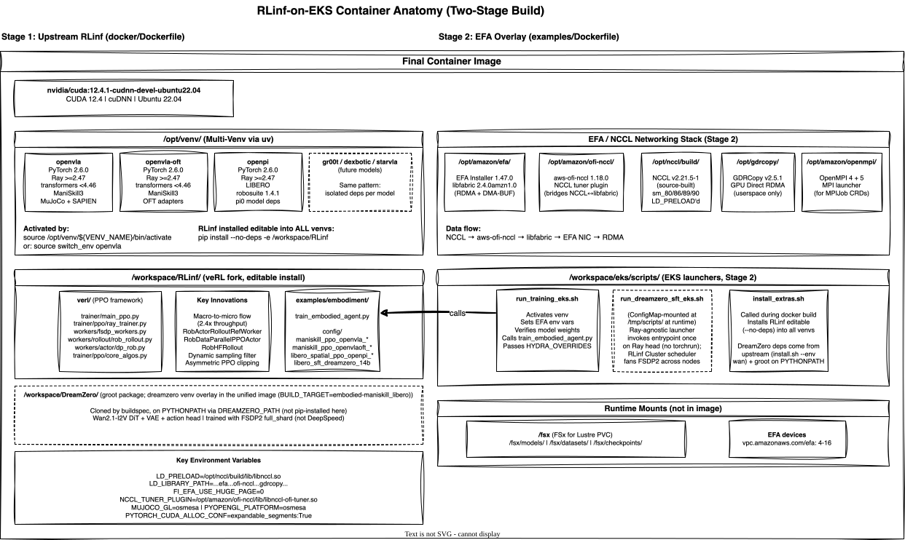

<!-- Copyright Amazon.com, Inc. or its affiliates. All Rights Reserved. -->
<!-- SPDX-License-Identifier: MIT-0 -->

# RLinf Reference Implementation

> **Framework**: RLinf v0.2 -- Reinforcement Learning (RL) Infrastructure for Embodied and Agentic AI
> **Paper**: Yu et al., "RLinf: Flexible and Efficient Large-scale RL via Macro-to-Micro Flow Transformation", arXiv:2509.15965, 2025
> **Code**: https://github.com/RLinf/RLinf
> **Docs**: https://rlinf.readthedocs.io/en/latest/

## What It Does

RLinf provides a flexible and scalable RL infrastructure for training Embodied and Agentic AI. It supports:

- **RL Algorithms**: GRPO (Group Relative Policy Optimization), PPO (Proximal Policy Optimization), DAPO, Reinforce++, SAC (Soft Actor-Critic), CrossQ, RLPD, SAC-Flow, DSRL, DAgger
- **Simulators**: ManiSkill, LIBERO, RoboTwin, CALVIN, RoboCasa, IsaacLab, MetaWorld, BEHAVIOR, Franka-Sim
- **Models**: OpenVLA, OpenVLA-OFT, pi0, pi0.5, GR00T, StarVLA, LingBot-VLA, Dexbotic
- **Training Backends**: FSDP (Fully Sharded Data Parallel) + HuggingFace/SGLang/vLLM, Megatron + SGLang/vLLM
- **Macro-to-Micro Flow Transformation**: Up to 2.434x throughput vs existing frameworks

## Container Build Strategy

We use a **two-stage build** that preserves upstream RLinf's dependency management while adding EFA (Elastic Fabric Adapter) networking for EKS (Elastic Kubernetes Service):

1. **Stage 1**: Build the upstream RLinf image using their `docker/Dockerfile` + `BUILD_TARGET` arg
2. **Stage 2**: Layer EFA/NCCL/GDRCopy networking stack on top via our `Dockerfile`

This gives us:
- **All upstream dependency management preserved** (uv, multi-venv, install.sh, model-specific isolation)
- **Multiple models per image** (e.g., `embodied-maniskill_libero` ships 6 venvs: openvla, openvla-oft, openpi, gr00t, dexbotic, starvla)
- **EFA networking for multi-node NCCL (NVIDIA Collective Communications Library) on EKS**
- **Any `BUILD_TARGET` works** -- we can build EKS images for any of the 15 upstream variants

The `switch_env` utility selects the active model at runtime:
```bash
source switch_env openvla      # OpenVLA
source switch_env openvla-oft  # OpenVLA-OFT
source switch_env openpi       # pi0
```

## Examples

All PPO examples use the **same container image** (`BUILD_TARGET=embodied-maniskill_libero`). The only difference is the `CONFIG_NAME`, `VENV_NAME`, and `MODEL_PATH` environment variables. DreamZero uses the same base image with `EXTRAS=dreamzero`.

| Example | Simulator | Algorithm | Model | Venv | Config |
|---------|-----------|-----------|-------|------|--------|
| [ManiSkill + OpenVLA PPO](maniskill-openvla-ppo/) | ManiSkill3 | PPO | OpenVLA 7B | `openvla` | `maniskill_ppo_openvla_quickstart` |
| [ManiSkill + OpenVLA-OFT PPO](maniskill-openvlaoft-ppo/) | ManiSkill3 | PPO | OpenVLA-OFT | `openvla-oft` | `maniskill_ppo_openvlaoft_quickstart` |
| [LIBERO + pi0 PPO](libero-pi0-ppo/) | LIBERO | PPO | pi0 | `openpi` | `libero_spatial_ppo_openpi_quickstart` |
| [DreamZero SFT](dreamzero/) | DROID | SFT | Wan2.1-14B | `openvla` | N/A (OmegaConf) |

### Future Examples (require different BUILD_TARGET)

| Example | Simulator | Model | BUILD_TARGET |
|---------|-----------|-------|-------------|
| RoboTwin + LingBot-VLA PPO | RoboTwin | LingBot-VLA | `embodied-robotwin` |
| CALVIN + pi0.5 PPO | CALVIN | pi0.5 | `embodied-calvin` |
| Agentic RL (SearchR1) | N/A | Qwen2.5-VL | `reason` |

## Compute Requirements

| Component | Requirement |
|-----------|-------------|
| **GPU** | 8x 80GB GPUs (Graphics Processing Units) per node (H100 recommended) |
| **Multi-node** | 1-2 nodes (8-16 GPUs total) |
| **VRAM per GPU** | 80GB (FSDP full-shard with CPU offload) |
| **CPU** | 192 cores per node (for parallel env rendering) |
| **Memory** | 1.8TB per node |
| **Network** | Low-latency, high-bandwidth for NCCL allreduce (EFA) |
| **Storage** | Shared filesystem for checkpoints + model weights (FSx for Lustre) |

## Software Stack

| Layer | Component | Version |
|-------|-----------|---------|
| **Python** | uv-managed venvs | Python 3.11 |
| **Framework** | PyTorch | 2.6.0 (upstream default) |
| **CUDA** | CUDA (Compute Unified Device Architecture) Toolkit | 12.4 |
| **RL Framework** | RLinf | 0.2 |
| **Distributed** | Ray | >=2.47.0 |
| **EFA** | EFA Installer | 1.47.0 |
| **NCCL** | NCCL (source-built) | 2.21.5-1 |
| **Config** | Hydra / OmegaConf | Latest |
| **Tracking** | TensorBoard (default) | Latest |

## Container Anatomy

The training container is built in two stages:

- **Stage 1 (upstream RLinf)**: RL framework, training scripts, Hydra configs, simulators, multi-venv isolation. RLinf is a veRL fork with embodied-AI extensions (macro-to-micro flow, 2.4x throughput).
- **Stage 2 (this repo)**: AWS EFA networking stack for multi-node NCCL, EKS-specific launch scripts, optional extras (DreamZero).



| Layer | Provides | Path |
|-------|----------|------|
| CUDA base | GPU drivers, cuDNN (CUDA Deep Neural Network library) | System |
| RLinf venvs | Per-model Python environments (openvla, openpi, etc.) | `/opt/venv/` |
| RLinf source | PPO training loop, Hydra configs, veRL workers | `/workspace/RLinf/` |
| DreamZero (optional) | Video world model SFT | `/workspace/DreamZero/` |
| EFA stack | libfabric 2.4, aws-ofi-nccl, NCCL, GDRCopy (GPU Direct RDMA Copy), OpenMPI | `/opt/amazon/`, `/opt/nccl/` |
| EKS scripts | Training launcher, install_extras | `/workspace/eks/scripts/` |
| Runtime mounts | Model weights, datasets, checkpoints, EFA devices | `/fsx/` (PVC (PersistentVolumeClaim)) |

## Training Metrics

RLinf writes [TensorBoard](https://www.tensorflow.org/tensorboard) event files to FSx as the default logger. Events are stored at `/fsx/checkpoints/<experiment>/tensorboard/`.

To view training metrics locally:

```bash
kubectl port-forward <training-pod> 6006:6006 -n rlinf &
tensorboard --logdir /fsx/checkpoints/<experiment>/tensorboard --port 6006
```

Or use `examples/scripts/plot_training_curve.py` to generate static PNG charts from completed runs.

For additional experiment tracking (run comparison, artifact management), enable the optional [MLflow addon](../infrastructure/README.md#mlflow-experiment-tracking).

## Directory Structure

```
examples/
├── Dockerfile                          # Stage 2: EFA overlay on upstream image
├── buildspec.yml                       # CodeBuild: two-stage build
├── README.md                           # This file
├── scripts/
│   ├── run_training_eks.sh             # Generic training launcher (any config)
│   ├── run_dreamzero_sft_eks.sh        # DreamZero multi-node SFT launcher (torchrun)
│   ├── plot_training_curve.py          # TensorBoard events → training curve PNG
│   ├── generate_video_predictions.py   # Offline inference: checkpoint → video + actions
│   ├── compose_side_by_side.py         # 3×2 grid composition (GT vs prediction)
│   ├── compose_with_actions.py         # Video + action trajectory dual-panel
│   ├── fast_hf_download.py             # Fast parallel HF dataset downloader
│   └── install_extras.sh              # Conditional package installer for EXTRAS
├── maniskill-openvla-ppo/              # ManiSkill + OpenVLA PPO
├── maniskill-openvlaoft-ppo/           # ManiSkill + OpenVLA-OFT PPO
├── libero-pi0-ppo/                     # LIBERO + pi0 PPO
└── dreamzero/                          # DreamZero SFT (multi-node)
```

## Quick Start

```bash
# 1. Deploy infrastructure (from repo root)
./infrastructure/deploy.sh --action apply --layer all

# 2. Configure kubectl
$(terraform -chdir=infrastructure/cluster output -raw configure_kubectl)

# 3. Build container image via CodeBuild
#    BUILD_TARGET defaults to embodied-maniskill_libero (covers all PPO examples)
zip -r rlinf-on-eks.zip examples/Dockerfile examples/buildspec.yml examples/scripts/
aws s3 cp rlinf-on-eks.zip s3://$(terraform -chdir=infrastructure/build output -raw codebuild_source_bucket)/rlinf-on-eks.zip
aws codebuild start-build --project-name $(terraform -chdir=infrastructure/build output -raw codebuild_project_name)

# 4. Stage model weights (per-example -- pick one or run all)
#    Use restricted envsubst to avoid expanding shell vars in download scripts
envsubst '${NAMESPACE}' < examples/maniskill-openvla-ppo/manifests/model-download.yaml | kubectl apply -f -
envsubst '${NAMESPACE}' < examples/maniskill-openvlaoft-ppo/manifests/model-download.yaml | kubectl apply -f -
envsubst '${NAMESPACE}' < examples/libero-pi0-ppo/manifests/model-download.yaml | kubectl apply -f -

# 5. Run container validation
export ECR_URI=$(terraform -chdir=infrastructure/build output -raw ecr_repository_url)
envsubst < infrastructure/manifests/container-test.yaml | kubectl apply -f -
kubectl logs -f job/container-test

# 6. Launch training (pick an example)
# ManiSkill + OpenVLA PPO
envsubst < examples/maniskill-openvla-ppo/manifests/maniskill-openvla-ppo.yaml | kubectl apply -f -

# ManiSkill + OpenVLA-OFT PPO
envsubst < examples/maniskill-openvlaoft-ppo/manifests/maniskill-openvlaoft-ppo.yaml | kubectl apply -f -

# LIBERO + pi0 PPO
envsubst < examples/libero-pi0-ppo/manifests/libero-pi0-ppo.yaml | kubectl apply -f -

# DreamZero SFT (multi-node, requires EXTRAS=dreamzero image build)
envsubst < examples/dreamzero/manifests/dreamzero-sft.yaml | kubectl apply -f -

# 7. Monitor
kubectl logs -f job/rlinf-maniskill-openvla    # or whichever example
```

## DreamZero: World Action Model (WAM)

DreamZero is a **World Action Model** -- a single 14B-parameter Diffusion Transformer (DiT) built on the Wan2.1-I2V-14B-480P video generation backbone that jointly denoises future video and future robot actions in shared attention layers.

Trained on the DROID (Distributed Robot Interaction Dataset) dataset (real Franka Panda robot demonstrations from multiple labs), the model learns to predict both what will happen in the world (video) and what the robot should do (7-DOF (Degrees of Freedom) joint positions) — using video prediction as a computational scaffold for action reasoning.

| Result | Value |
|--------|-------|
| Loss (0 → 1000 steps) | 0.60 → 0.0975 |
| Throughput | 12.1 s/step (2 nodes, 16x H200) |
| Training Time | 3.4 hours |
| Cost | ~$660 |
| Checkpoint Size | 282 GB |

See [dreamzero/README.md](dreamzero/README.md) for full results, architecture, and reproduction instructions.

## AWS Instance Recommendation

| Scenario | Instance | Nodes | Total GPUs | Estimated Cost/hr |
|----------|----------|-------|------------|-------------------|
| **Infrastructure validation** | g6.8xlarge | 2 | 2 | ~$2 |
| **Development / quickstart** | p4de.24xlarge | 1 | 8 | ~$41 |
| **Production training (PPO)** | p5.48xlarge | 1-2 | 8-16 | ~$98-197 |
| **DreamZero SFT (14B)** | p5en.48xlarge | 2 | 16 | ~$230 |

g6.8xlarge is for EFA/NCCL/container validation only -- the single L4 GPU cannot fit a 7B VLA model.

## Validation

The repo includes a layered validation harness that tests the full stack from static code checks to training step verification.

```bash
# Local validation (no cluster required)
./validate.sh --mode local

# Cluster validation (requires live EKS cluster)
./validate.sh --mode cluster --level 3    # Up to NCCL/EFA
./validate.sh --mode cluster --level 5    # Up to training steps
./validate.sh --mode cluster              # All levels (L0-L6)

# Advanced
./validate.sh --mode cluster --skip-to 2  # Resume from L2
./validate.sh --mode cluster --level 5 --example maniskill-openvla  # Single example
./validate.sh --mode cluster --continue-on-error  # Don't stop on failure
```

### Validation Levels (Cluster Mode)

| Level | Name | What it Tests | Approx Time |
|-------|------|---------------|-------------|
| L0 | Infrastructure | GPU, EFA devices, FSx mount | ~1 min |
| L1 | Container Build | CodeBuild two-stage image, ECR (Elastic Container Registry) push | ~15 min |
| L2 | Container Test | 10 tests: CUDA, EFA libs, venvs, Ray, MPI (Message Passing Interface) | ~2 min |
| L3 | NCCL/EFA | allreduce bandwidth threshold via MPIJob | ~3 min |
| L4 | Model Download | HuggingFace model weights to FSx | ~30 min |
| L5 | Training Steps | 1 PPO step per example (x3) | ~30 min |
| L6 | Multi-Node | 2-node Ray cluster, 1 training step | ~10 min |

### Training Step Test (L5)

Uses `runner.max_steps=1` Hydra override to limit RLinf to exactly 1 PPO step. Tests each example independently:

| Example | Venv | Config |
|---------|------|--------|
| ManiSkill + OpenVLA | `openvla` | `maniskill_ppo_openvla_quickstart` |
| ManiSkill + OpenVLA-OFT | `openvla-oft` | `maniskill_ppo_openvlaoft_quickstart` |
| LIBERO + pi0 | `openpi` | `libero_spatial_ppo_openpi_quickstart` |
| DreamZero SFT | `openvla` | N/A (uses OmegaConf overrides via torchrun) |
