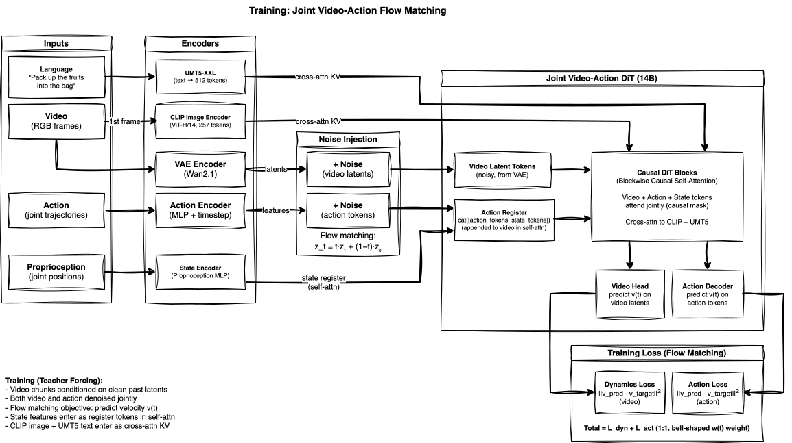

<!-- Copyright Amazon.com, Inc. or its affiliates. All Rights Reserved. -->
<!-- SPDX-License-Identifier: MIT-0 -->

# DreamZero: LIBERO 14B SFT + Simulator Eval on EKS

> **⚠️ Non-commercial model license.** This example uses the
> [`GEAR-Dreams/DreamZero-DROID`](https://huggingface.co/GEAR-Dreams/DreamZero-DROID)
> model, released under a **non-commercial license**
> ([CC-BY-NC-4.0](https://spdx.org/licenses/CC-BY-NC-4.0)). Any production use of
> this model needs additional approvals. Review the license terms before using it.
> (This note concerns the *model* only; the code in this repository is MIT-0.)

Continue supervised fine-tuning (SFT) of the released **DreamZero-DROID 14B World-Action Model** on a *new embodiment's* data (LIBERO), then evaluate it in the LIBERO simulator and visualize in-sim rollout videos. Runs full-parameter SFT across **2x p5en.48xlarge** (16x NVIDIA H200 141 GB) with **Ray + FSDP2** over **EFA RDMA**.

This is the canonical customer workflow: take a pretrained DreamZero checkpoint and adapt it to your own robot data, then close the loop with simulator evaluation.

> **Validation scope (read this first):** This pipeline was validated end-to-end on EKS with a **1-step** SFT run. That proves the *infrastructure and the pipeline* — build, multi-node EFA/NCCL, FSDP2 sharded checkpointing, DCP→`.pt` conversion, and LIBERO simulator eval — **not task accuracy**. A 1-step checkpoint yields `eval/success_once = 0.0`, which is expected. Real accuracy requires a multi-step training run (the pipeline supports it; see [Results](#results)). No success numbers or loss curves are fabricated here.

## What This Demonstrates

- **Cross-embodiment transfer (the customer story).** The released `GEAR-Dreams/DreamZero-DROID` checkpoint was pretrained on DROID (Franka arm). We continue SFT on `physical-intelligence/libero` (a different embodiment, `libero_sim`) to show how you would adapt DreamZero to *your* robot's trajectories. There is no native LIBERO 14B checkpoint upstream — warm-starting from DROID is the point.
- **Multi-node GPU training on EKS.** RLinf's `Cluster` (Ray) scheduler fans FSDP2 `full_shard` across 16 H200s on 2 nodes. Gradient sync flows over NCCL on EFA RDMA (libfabric 2.4 / aws-ofi-nccl 1.18, GDRDMA). This is the FSDP2 + Ray design — **not** torchrun/DeepSpeed.
- **Closed-loop simulator evaluation.** The trained model is evaluated *in the LIBERO simulator* (not offline video prediction): it drives the sim, reports `eval/success_once`, and the world-model generates in-sim rollout videos (written to `{log_path}/video/eval/seed_*/0.mp4`). At the 1-step validation checkpoint these rollouts demonstrate the rendering/eval machinery rather than a competent policy, so none are shipped here as a showcase artifact.

## Architecture

DreamZero is a **16.48B-parameter World-Action Model (WAM)** — a Wan-based video-diffusion Diffusion Transformer (DiT) that jointly denoises future video frames and future robot actions in a **shared causal self-attention** space. The model simultaneously predicts what will happen (video) and what to do (actions); the video prediction acts as a computational scaffold for action reasoning. SFT is full-parameter (all 16.48B weights are trained).

| Component | Role |
|-----------|------|
| DiT backbone (14B-class WAM) | Shared denoising over video + action tokens (dim 5120, 40 layers) |
| Action Register | Concatenation of noisy action tokens + state-encoder output; participates in joint attention |
| UMT5-XXL | Encodes task-instruction text (`google/umt5-xxl` tokenizer) |
| CLIP / image conditioning | Encodes the observation frame for cross-attention conditioning |
| Wan VAE | Compresses/decodes video latents |
| Action Decoder | Projects denoised action tokens to per-embodiment joint positions |

### Joint Video-Action Flow Matching (training)



> **Source:** [diagrams/dreamzero-wam.drawio](diagrams/dreamzero-wam.drawio)

During training, video frames and actions are each encoded and corrupted with noise via flow-matching interpolation — the linear path from Eq 2 of the paper: `z_t = t·z₁ + (1−t)·z₀`, where `z₁` is the clean sample, `z₀ ~ N(0,I)` is Gaussian noise, and `t ∈ [0,1]` (t=0 is pure noise, t=1 is clean). The noisy video latent tokens and the **Action Register** participate together in blockwise causal self-attention — this is the "joint" in Joint Video-Action. CLIP image embeddings and UMT5-XXL text embeddings condition the DiT via cross-attention. Two output heads predict the velocity field `v(t)`: one for video (dynamics loss) and one for actions (action loss). Both are MSE between predicted and target velocity, weighted equally (1:1) with a bell-shaped, midpoint-centered timestep weight `w(t) = exp(-2·((t - T/2) / T)²)` (the `bsmntw_weighting` in DreamZero's `FlowMatchScheduler`), which emphasizes mid-range noise levels where the learning signal is richest.

```
loss = weighted_dynamics_loss + weighted_action_loss
```

The video loss is not auxiliary — it is the mechanism by which the model learns physics (gravity, contact, object permanence). Better video prediction → better actions. At deployment the robot consumes only the action channel; the video channel serves as a computational scaffold.

### Distributed training shape

| Property | Value |
|----------|-------|
| K8s kind | KubeRay `RayJob` (run-to-completion) + embedded RayCluster (head 1 + worker 1) |
| GPU instance | p5en.48xlarge (8x H200 141 GB) |
| GPUs total | 16 (2 nodes x 8) |
| Scheduler | RLinf `Cluster` (Ray head/worker) — **not** torchrun |
| Shard strategy | FSDP2 `full_shard` across all 16 GPUs (the 16.48B model is sharded, not replicated) |
| Networking | EFA RDMA, 16 NICs/node (libfabric 2.4, aws-ofi-nccl 1.18, NCCL over GDRDMA) |
| Storage | Shared FSx for Lustre at `/fsx` (models, dataset, checkpoints) |

The KubeRay operator starts the Ray head and one worker, then runs the Ray-agnostic launcher as the head `entrypoint` once the cluster is ready; `shutdownAfterJobFinishes` tears the cluster down when training ends. Pod anti-affinity guarantees one pod per physical node.

## Pipeline / Reproduce

Six stages, each validated on EKS. Throughout: `NAMESPACE` is your cluster namespace (e.g. `rlinf`) and `ECR_URI` is the training image repo.

```bash
export NAMESPACE=rlinf
export ECR_URI=$(terraform -chdir=infrastructure/build output -raw ecr_repository_url)
```

**Prerequisites:** an EKS cluster that can provision 2x p5en.48xlarge via Karpenter, an FSx for Lustre PVC `fsx-claim` bound at `/fsx` (plan **≥250 GB free** — a 14B FSDP DCP checkpoint is ~140–206 GB), and the `training-sa` ServiceAccount (all created by `infrastructure/deploy.sh`).

### 1. Build the container

DreamZero runs in the **`dreamzero` venv**, which the upstream `embodied-libero` build target now builds natively (RLinf PR #1272) — the EKS overlay no longer rebuilds it. The external `groot` package is cloned from `github.com/RLinf/dreamzero.git` by the buildspec and placed on `PYTHONPATH` via `DREAMZERO_PATH`. Both external repos are pinned to commits in `examples/buildspec.yml` (`UPSTREAM_REF=b3bbabb1f461`, `DREAMZERO_REF=ab790c198fbc`); `BUILD_TARGET=embodied-libero` is the buildspec default.

```bash
zip -r rlinf-on-eks.zip examples/Dockerfile examples/buildspec.yml examples/scripts/
aws s3 cp rlinf-on-eks.zip \
  s3://$(terraform -chdir=infrastructure/build output -raw codebuild_source_bucket)/rlinf-on-eks.zip
aws codebuild start-build \
  --project-name $(terraform -chdir=infrastructure/build output -raw codebuild_project_name)
```

### 2. Stage models + dataset to FSx

Downloads the DreamZero-DROID 14B warm-start checkpoint, the umt5-xxl tokenizer, and the `physical-intelligence/libero` dataset (LeRobot layout). The dataset **must** be `physical-intelligence/libero`, not `lerobot/libero` (different `observation.state`/`action` schema).

A Hugging Face token is optional for these public repos but **recommended**: create a `hf-token` Secret (`kubectl create secret generic hf-token --from-literal=HF_TOKEN=hf_...`) to avoid the stricter anonymous per-IP rate limits behind the shared NAT gateway. The Job runs anonymously if the Secret is absent.

```bash
envsubst < examples/dreamzero/manifests/model-download.yaml | kubectl apply -f -
kubectl logs -f job/model-download-dreamzero -n "$NAMESPACE"
```

Then generate the `libero_sim` normalization metadata. The DreamZero-DROID checkpoint bundles `experiment_cfg/metadata.json` for `oxe_droid` **only**, so LIBERO SFT would fail with `KeyError: embodiment_tag 'libero_sim' not found` without this step. It runs in the training image (needs the RLinf toolkit + the `dreamzero` venv), hence **restricted** `envsubst`:

```bash
envsubst '${ECR_URI} ${NAMESPACE}' \
  < examples/dreamzero/manifests/generate-metadata.yaml | kubectl apply -f -
kubectl logs -f job/generate-metadata-dreamzero -n "$NAMESPACE"
# -> writes /fsx/models/metadata-libero.json
```

### 3. Multi-node SFT (2x p5en.48xlarge)

Create the launcher ConfigMap, then apply the RayJob with **restricted** `envsubst` (substitute *only* `${ECR_URI}` and `${NAMESPACE}`). The KubeRay operator elects the Ray head — there is no inline head-election bash — but the RayJob `entrypoint` still contains an inline `bash -c` block, so keep the restricted form to avoid expanding it:

```bash
kubectl -n "$NAMESPACE" create configmap dreamzero-sft-launcher \
  --from-file=run_dreamzero_sft_eks.sh=examples/dreamzero/scripts/run_dreamzero_sft_eks.sh \
  --dry-run=client -o yaml | kubectl apply -f -

envsubst '${ECR_URI} ${NAMESPACE}' \
  < examples/dreamzero/manifests/dreamzero-sft.yaml | kubectl apply -f -

kubectl logs -f -n "$NAMESPACE" job/dreamzero-sft
```

The launcher (`run_dreamzero_sft_eks.sh`) drives `examples/sft/train_vla_sft.py` with config `libero_sft_dreamzero_14b`. It passes `actor.model.num_action_per_block=16` (the config sets `action_horizon=16` but inherits `num_action_per_block=24` from the DROID model default — a mismatch trips the forward-pass assertion) and adds `+actor.model.metadata_json_path=/fsx/models/metadata-libero.json` (the key is commented out in the config struct, so it must be *added* with the Hydra `+` prefix). SFT writes a **sharded FSDP DCP** checkpoint (`.distcp` + `.metadata`) under `.../global_step_<N>/actor/dcp_checkpoint/`.

To run a real (multi-step) training job instead of the 1-step validation, append Hydra overrides via the launcher's `HYDRA_OVERRIDES` env var (e.g. raise `runner.max_steps` and set a `save_interval`).

### 4. Convert checkpoint (DCP shards → `.pt`)

Eval needs a single consolidated `.pt`. Convert offline on CPU (do **not** use `+actor.fsdp_config.save_full_model_weights=true` — the rank-0 full-state-dict gather for the 16B model stalls on 2x p5en):

```bash
kubectl -n "$NAMESPACE" create configmap dreamzero-convert-launcher \
  --from-file=convert_checkpoint.sh=examples/dreamzero/scripts/convert_checkpoint.sh \
  --dry-run=client -o yaml | kubectl apply -f -

envsubst '${ECR_URI} ${NAMESPACE}' \
  < examples/dreamzero/manifests/convert-checkpoint.yaml | kubectl apply -f -
kubectl logs -f job/dreamzero-convert -n "$NAMESPACE"
# -> .../global_step_1/actor/model_state_dict/full_weights.pt
```

(Default `STEP=global_step_1`; override the env in the manifest for a later step.)

### 5. LIBERO simulator eval (single-node GPU)

Single-pod GPU Job (`cluster.num_nodes=1`, single-node FSDP across 8 H200). Uses our 14B eval config `configs/libero_spatial_eval_dreamzero_14b.yaml` (upstream ships only a 5B eval config). Create **both** ConfigMaps — the launcher *and* the eval config (the config is copied into the embodiment config dir at runtime so upstream config groups stay visible; mounting over the dir would hide them):

```bash
kubectl -n "$NAMESPACE" create configmap dreamzero-eval-launcher \
  --from-file=run_dreamzero_eval_eks.sh=examples/dreamzero/scripts/run_dreamzero_eval_eks.sh \
  --dry-run=client -o yaml | kubectl apply -f -

kubectl -n "$NAMESPACE" create configmap dreamzero-eval-config \
  --from-file=libero_spatial_eval_dreamzero_14b.yaml=examples/dreamzero/configs/libero_spatial_eval_dreamzero_14b.yaml \
  --dry-run=client -o yaml | kubectl apply -f -

envsubst '${ECR_URI} ${NAMESPACE}' \
  < examples/dreamzero/manifests/dreamzero-eval.yaml | kubectl apply -f -
kubectl logs -f job/dreamzero-eval -n "$NAMESPACE"
```

The eval reports `eval/success_once` and (with `SAVE_VIDEO=True`, the default) writes in-sim rollout videos to `{LOG_DIR}/video/eval/seed_*/0.mp4`. The 14B config uses `total_num_envs=16` (the upstream 5B default of 128 OOMs the 16.48B model co-located with the sim on 8x H200).

### 6. In-sim rollout videos

The eval's in-sim rollout MP4s land on FSx at `/fsx/checkpoints/dreamzero-libero-eval/video/eval/seed_*/0.mp4` (this replaced the old offline DROID prediction/compose pipeline). Copy one out for inspection:

```bash
# from inside any pod with /fsx mounted, or via `kubectl cp`:
kubectl cp <eval-pod>:/fsx/checkpoints/dreamzero-libero-eval/video/eval/seed_0/0.mp4 ./rollout-seed0.mp4
```

At the 1-step validation checkpoint these rollouts show the robot drifting (`success_once = 0.0`), which validates the rendering/eval machinery, not policy competence — so no rollout is committed to this repo as a showcase artifact. Render one from a multi-step run if you want a meaningful rollout.

## Gotchas

The authoritative, full list lives in [`examples/AGENTS.md`](../AGENTS.md) (DreamZero section). The ones you are most likely to hit:

- **`dreamzero` venv built by upstream.** `VENV_NAME=dreamzero`; the `embodied-libero` target builds it natively (RLinf PR #1272, pinned `b3bbabb1f461`). It must be its own venv — layering `dreamzero.txt` onto another env hits an unsatisfiable `lerobot 0.3.3` vs `torchcodec 0.2` resolve.
- **Restricted `envsubst` everywhere.** Always `envsubst '${ECR_URI} ${NAMESPACE}' < ...`. The Ray head-election bash is gone (the KubeRay operator handles it), but the RayJob `entrypoint` and other manifests still embed inline shell that unrestricted substitution would clobber.
- **Generate `libero_sim` metadata** (stage 2) before SFT/eval — the DROID checkpoint only ships `oxe_droid` stats.
- **`num_action_per_block=16`** must override the inherited DROID default of 24 (temporal-alignment assertion). The launcher and eval config both set this.
- **FSx free space ≥250 GB.** A full filesystem truncates `torch.save` mid-write → `inline_container.cc unexpected pos` → corrupt, unreadable DCP shards (EOFError on convert).
- **DCP → `.pt` convert is mandatory** for eval; do not try to save full model weights from the FSDP run on this model size.
- **Dataset is `physical-intelligence/libero`**, never `lerobot/libero`.

## Results

This example was validated end-to-end on EKS with a **1-step** SFT run:

| Stage | Validated outcome |
|-------|-------------------|
| Build | `dreamzero` venv image built + pushed (CodeBuild) |
| Stage | DreamZero-DROID + umt5-xxl + LIBERO dataset on FSx; `libero_sim` metadata generated |
| SFT | 2x p5en.48xlarge, Ray + FSDP2, EFA RDMA; sharded DCP checkpoint written |
| Convert | DCP shards → `full_weights.pt` |
| Eval | LIBERO simulator ran; `eval/success_once = 0.0`; in-sim rollout video rendered |

**`success_once = 0.0` is the expected result for a 1-step checkpoint** — the eval gate validates the machinery (multi-node training, sharded checkpointing, conversion, simulator eval, video rendering), not policy competence. To obtain real task accuracy, run a multi-step SFT job (stage 3, raising `runner.max_steps` via `HYDRA_OVERRIDES` and setting a checkpoint `save_interval`), convert the resulting `global_step_<N>` checkpoint (stage 4), and re-run eval (stage 5). Loss can be plotted from the training run's TensorBoard logs with `scripts/plot_dreamzero_loss.py`.

## File Layout

```
examples/dreamzero/
├── README.md                       # This file
├── configs/
│   └── libero_spatial_eval_dreamzero_14b.yaml  # 14B LIBERO eval config (ours; upstream ships 5B only)
├── manifests/
│   ├── model-download.yaml         # Stage DreamZero-DROID + umt5-xxl + physical-intelligence/libero
│   ├── generate-metadata.yaml      # CPU Job: libero_sim normalization metadata.json
│   ├── dreamzero-sft.yaml          # KubeRay RayJob (embedded RayCluster), 2-node FSDP2 SFT
│   ├── convert-checkpoint.yaml     # CPU Job: DCP shards -> full_weights.pt
│   └── dreamzero-eval.yaml         # Single-node GPU Job: LIBERO sim eval + in-sim video
├── scripts/
│   ├── run_dreamzero_sft_eks.sh    # Multi-node SFT launcher (Ray-agnostic, FSDP2)
│   ├── convert_checkpoint.sh       # DCP -> .pt conversion launcher
│   ├── run_dreamzero_eval_eks.sh   # LIBERO simulator eval launcher
│   ├── fast_hf_download.py         # Fast parallel HF downloader (for large datasets)
│   └── plot_dreamzero_loss.py      # Plot SFT loss curve from TensorBoard (multi-step runs)
└── diagrams/                       # draw.io sources + rendered SVGs
```
