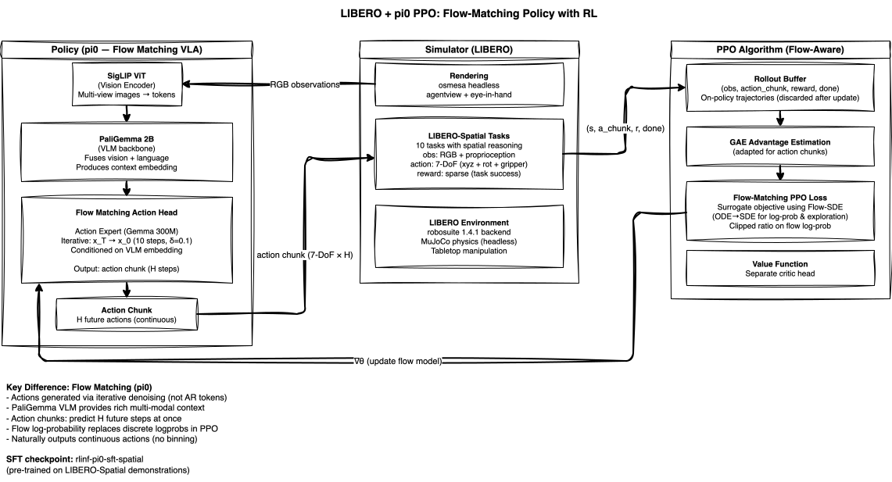
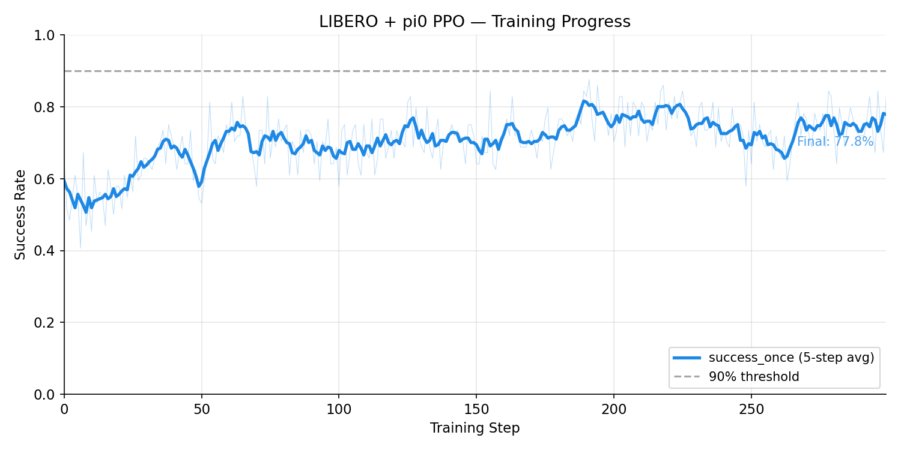

<!-- Copyright Amazon.com, Inc. or its affiliates. All Rights Reserved. -->
<!-- SPDX-License-Identifier: MIT-0 -->

# LIBERO Spatial + pi0 PPO on EKS

Single-node RL (reinforcement learning) fine-tuning of [pi0](https://www.physicalintelligence.company/blog/pi0) (3B flow-matching VLA (Vision-Language-Action model)) on LIBERO (Lifelong Embodied Robot Operation) spatial manipulation tasks using Proximal Policy Optimization (PPO).

> **Validated on EKS.** This deployment was run end-to-end on Amazon EKS; PPO fine-tuning converged to an **81.6% peak success rate**. Use it as a starting point for your own training runs (see [Results](#results) for the reference run).

<video src="assets/libero_pi0_success.mp4" width="720" autoplay loop muted></video>

*32 parallel LIBERO-Spatial evaluation episodes from the trained pi0 policy (agentview camera). Each tile shows the robot arm completing a different spatial manipulation task — picking objects from specific locations and placing them at target positions.*

## Overview

| Property | Value |
|----------|-------|
| **Model** | pi0 (3B params: PaliGemma VLM (Vision-Language Model) + flow-matching action expert) |
| **Algorithm** | PPO (Proximal Policy Optimization) |
| **Environment** | LIBERO Spatial (10 tasks, MuJoCo physics) |
| **Hardware** | 1x p5en.48xlarge (8x H200 141GB) |
| **EFA** | 4x EFA (Elastic Fabric Adapter) adapters (for future multi-node scale-out) |
| **Config** | `libero_spatial_ppo_openpi_quickstart` |
| **SFT Checkpoint** | `RLinf/RLinf-Pi0-SFT-Spatial-Object-Goal` |

## How It Works

### pi0: Flow-Matching Action Generation

pi0 is architecturally distinct from the OpenVLA family. Instead of generating actions as discrete tokens through an autoregressive language model, pi0 uses a **flow-matching action expert** — a small denoising transformer that iteratively refines a noise vector into a precise action chunk. The VLM backbone (PaliGemma 2B) processes images and task language into a rich context embedding, which conditions the action expert's denoising process.

The key advantage is that flow matching naturally outputs continuous actions without binning artifacts, and predicts entire **action chunks** (H future timesteps simultaneously) rather than single-step actions. This temporal coherence improves manipulation quality for tasks requiring smooth, coordinated motions.

### PPO with Flow Log-Probabilities

Applying PPO to a flow-matching policy requires computing log-probabilities differently than with discrete token models. Instead of summing token log-probs, the policy's log-probability is derived from the flow matching score function — the learned denoising direction at each noise level. The clipped PPO surrogate objective operates on these flow log-probs, with advantages computed via GAE (Generalized Advantage Estimation) adapted for the action-chunk temporal structure.

### LIBERO-Spatial Tasks

LIBERO provides 10 tabletop manipulation tasks requiring spatial reasoning — picking objects from specific locations, placing them in target positions, and navigating around obstacles. Each task specifies a natural language goal (e.g., "pick up the red mug and place it on the shelf"). The environment uses robosuite 1.4.1 with MuJoCo physics, providing sparse rewards (success/failure) that make RL challenging but closer to real-world evaluation.

## Architecture

### Infrastructure


The infrastructure is shared across all three PPO examples. A single p5en.48xlarge node is provisioned by Karpenter when the training Job is submitted. The pod runs all RL components colocated on 8 H200 GPUs (Graphics Processing Units), with FSx for Lustre providing shared access to model weights, LIBERO dataset, and checkpoints. Unlike the ManiSkill examples which use GPU-accelerated simulation, LIBERO uses **CPU-based MuJoCo rendering** (`MUJOCO_GL=osmesa`), so this example uses **combined GPU placement** — actor, environment, and rollout all share GPUs 0-7 rather than splitting across subsets. The 64 parallel environments run entirely on CPU cores, making rollout throughput CPU-bound rather than GPU-bound. This explains the slower step time (~228s vs ~145s for ManiSkill). FSx stores additional LIBERO-specific data: the full dataset directory (`/fsx/datasets/libero`) and a pre-created config file that prevents LIBERO's `__init__.py` from hanging on an interactive `input()` call at import time. The pod sets `ROBOT_PLATFORM=LIBERO` and `LIBERO_DATASET_DIR` environment variables that are not needed by the ManiSkill examples.

### Model & Algorithm



The model diagram shows the flow-matching PPO loop specific to pi0. SigLIP encodes multi-view RGB observations (agentview + eye-in-hand cameras) into vision tokens, which PaliGemma 2B fuses with task language to produce a context embedding. The flow-matching action expert — a separate Gemma 300M transformer — iteratively denoises a random vector into an action chunk (H future timesteps) over 10 integration steps (δ=0.1), conditioned on this embedding. LIBERO returns observations and sparse rewards that populate the on-policy rollout buffer (trajectories are discarded after each PPO update). The central challenge is computing log-probabilities for a flow model's continuous outputs: RLinf uses the **Flow-SDE (Stochastic Differential Equation)** method, which converts the deterministic ODE (Ordinary Differential Equation) denoising trajectory into a stochastic differential equation, enabling both tractable log-likelihood estimation and built-in exploration. PPO then computes GAE advantages adapted for the action-chunk temporal structure and updates the action expert's parameters through the clipped surrogate loss — with `train_expert_only: True`, the PaliGemma VLM backbone remains frozen during RL, and only the 300M-parameter action expert receives gradient updates.

## Results



| Metric | Value |
|--------|-------|
| **Peak success_once** | 81.6% (step 189) |
| **Final success_once** | 77.8% (step 299) |
| **Steps trained** | 300 |
| **Step time** | ~228s |
| **Total training time** | ~19 hours |
| **Placement** | Combined: actor, env, rollout all on 0-7 |
| **Environments** | 64 parallel (MuJoCo CPU-based) |
| **Global batch size** | 320 |

Pi0's training curve shows more variance than the ManiSkill examples because LIBERO tasks are harder — 10 distinct spatial manipulation scenarios with different objects, target positions, and required strategies. The flow-matching policy starts at approximately 59% success from SFT and improves to a peak of 81.6% with PPO. The variance (±10%) reflects the diversity of the task suite: some tasks reach near-perfect success while others remain challenging.

To regenerate this chart from your own training run:

```bash
python examples/scripts/plot_training_curve.py \
    --logdir /fsx/checkpoints/<experiment>/tensorboard \
    --metric success_once \
    --output examples/libero-pi0-ppo/assets/training_curve.png \
    --title "LIBERO + pi0 PPO — Training Progress"
```

## Reproduce

### Prerequisites

- EKS (Elastic Kubernetes Service) cluster with GPU node group (p5en.48xlarge)
- FSx for Lustre with pre-staged model weights (`rlinf-pi0-sft-spatial`) and LIBERO dataset
- Container image built and pushed to ECR (Elastic Container Registry)

### 1. Download Model Weights

Downloads the pi0 SFT checkpoint to FSx. The LIBERO simulator dataset is **not**
downloaded here — LIBERO auto-downloads its assets to `LIBERO_DATASET_DIR`
(`/fsx/datasets/libero`) on the first training run. To pre-stage it for faster
startup, see the `rlinf-dataset-preparation` skill.

```bash
export NAMESPACE=rlinf  # or your namespace
envsubst '${NAMESPACE}' < examples/libero-pi0-ppo/manifests/model-download.yaml | kubectl apply -f -
kubectl logs -f job/model-download-libero-pi0 -n $NAMESPACE
```

### 2. Launch Training

```bash
export ECR_URI=$(terraform -chdir=infrastructure/build output -raw ecr_repository_url)
export NAMESPACE=rlinf
envsubst < examples/libero-pi0-ppo/manifests/libero-pi0-ppo.yaml | kubectl apply -f -
```

### 3. Monitor

```bash
kubectl logs -f job/rlinf-libero-pi0 -n $NAMESPACE
```

## Regenerating the Showcase Video

The showcase video at the top of this README can be regenerated from any training checkpoint using the shared script:

```bash
export ECR_URI=$(terraform -chdir=infrastructure/build output -raw ecr_repository_url)
export NAMESPACE=rlinf
export S3_BUCKET=$(terraform -chdir=infrastructure/storage output -raw fsx_s3_bucket)
export CKPT_PATH=/fsx/checkpoints/<run>/checkpoints/global_step_<N>/actor/model_state_dict/full_weights.pt

./examples/scripts/generate-showcase-video.sh libero-pi0-ppo
```

The script deploys `manifests/eval-video.yaml` as a Kubernetes Job, waits for completion, downloads the raw video from S3, re-encodes it, and places the result in `assets/libero_pi0_success.mp4`. No frame stripping is needed for this example (action chunks = 1). The video is rendered at 256x256 (LIBERO's native resolution) at 30fps.

**Requirements**: `kubectl`, `aws` CLI, `envsubst`, and optionally `ffmpeg` (for re-encoding). The cluster must have a GPU node available and model weights + LIBERO dataset pre-staged on FSx.

## File Layout

```
examples/libero-pi0-ppo/
├── README.md               # This file
├── assets/                 # Training curves and showcase videos
│   ├── training_curve.png
│   └── libero_pi0_success.mp4
├── diagrams/
│   ├── model-libero-pi0-ppo.drawio     # Model/algorithm diagram
│   └── model-libero-pi0-ppo.drawio.svg
├── manifests/
│   ├── eval-video.yaml              # Showcase video eval Job
│   ├── model-download.yaml              # Model weight staging
│   └── libero-pi0-ppo.yaml             # Training Job
└── video_artifacts/        # Raw eval dumps (gitignored)
```
