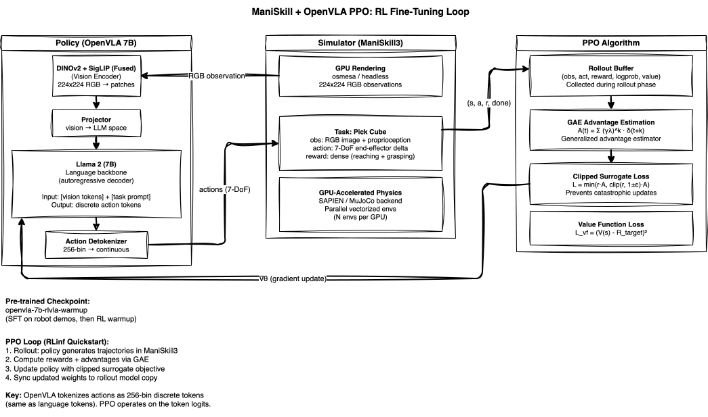
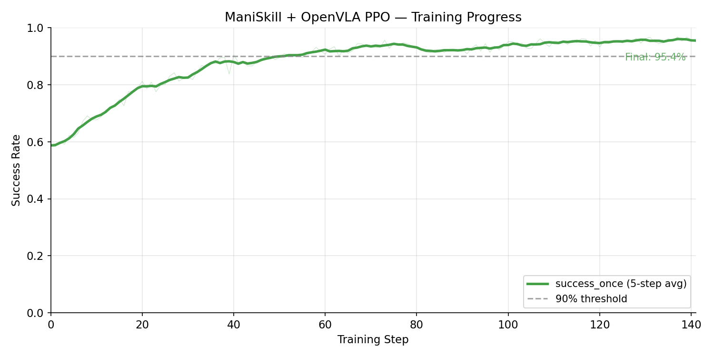

<!-- Copyright Amazon.com, Inc. or its affiliates. All Rights Reserved. -->
<!-- SPDX-License-Identifier: MIT-0 -->

# ManiSkill + OpenVLA PPO on EKS

Single-node RL (reinforcement learning) fine-tuning of [OpenVLA](https://openvla.github.io/) (7B VLA (Vision-Language-Action model)) on ManiSkill3 robotic manipulation tasks using Proximal Policy Optimization (PPO).

> **Status**: Training complete. Peak success rate **96.0%** at step 137.

<video src="assets/maniskill_openvla_success.mp4" width="720" autoplay loop muted></video>

*Parallel ManiSkill3 evaluation rollouts from the trained OpenVLA policy. Each tile shows the robot arm completing a pick-and-place task using discrete action tokens generated autoregressively by the 7B VLA.*

## Overview

| Property | Value |
|----------|-------|
| **Model** | OpenVLA 7B (pre-trained, RL warmup checkpoint) |
| **Algorithm** | PPO (Proximal Policy Optimization) |
| **Environment** | ManiSkill3 (GPU-accelerated sim) |
| **Hardware** | 1x p5en.48xlarge (8x H200 141GB) |
| **EFA** | 4x EFA (Elastic Fabric Adapter) adapters (for future multi-node scale-out) |
| **Config** | `maniskill_ppo_openvla` |
| **SFT Checkpoint** | `gen-robot/openvla-7b-rlvla-warmup` |

## How It Works

### OpenVLA: Vision-Language-Action Model

OpenVLA is a 7B parameter VLA built on Llama 2 with a fused DINOv2 + SigLIP vision encoder (from the Prismatic VLM (Vision-Language Model)). It treats robot actions as discrete tokens — the same vocabulary and autoregressive generation mechanism used for language. Each action dimension is quantized into 256 bins, and the model generates a sequence of action tokens given an image observation and task description.

The pre-trained checkpoint (`openvla-7b-rlvla-warmup`) has already been through supervised fine-tuning (SFT) on robot demonstration data and a brief RL warmup phase. Our PPO training continues this process, using online interaction with ManiSkill3 to further improve task success rates.

### PPO Loop

The training loop runs entirely within a single Kubernetes Job on one p5en.48xlarge node. RLinf colocates all RL components on the same 8 GPUs (Graphics Processing Units):

1. **Rollout phase**: The policy model generates action tokens given simulator observations. Multiple parallel environments collect trajectories simultaneously.
2. **Advantage computation**: GAE (Generalized Advantage Estimation) computes per-step advantages from collected rewards and value estimates.
3. **Policy update**: The clipped PPO surrogate objective updates the policy weights via FSDP (Fully Sharded Data Parallel)-sharded backpropagation across all 8 GPUs.
4. **Weight sync**: Updated weights are broadcast to the rollout model copy for the next collection phase.

The GPU-accelerated ManiSkill3 simulator (SAPIEN backend) renders observations and steps physics entirely on GPU, enabling high-throughput data collection without CPU bottlenecks.

## Architecture

### Infrastructure


The infrastructure diagram shows the EKS (Elastic Kubernetes Service) deployment pattern for single-node PPO training. Karpenter provisions a p5en.48xlarge GPU node on-demand when the training Job is submitted. The pod pulls its container image from ECR (Elastic Container Registry) (built via CodeBuild's two-stage process) and mounts FSx for Lustre to access pre-trained model weights and write checkpoints. All RL components — actor, rollout, environment, and PPO trainer — run colocated inside a single pod with 8 H200 GPUs allocated via the GPU Operator's device plugin. This example uses **split GPU placement**: the actor model occupies GPUs 0-7, rollout inference runs on GPUs 4-7, and the GPU-accelerated ManiSkill3 simulator (SAPIEN backend) shares GPUs 0-3 with environment workers. This split maximizes throughput by overlapping simulation rendering with rollout inference on separate GPU subsets. The pod also allocates 64Gi of `/dev/shm` shared memory for high-bandwidth interprocess communication between the GPU-accelerated environment workers.

### Model & Algorithm



The model diagram shows the PPO RL loop with OpenVLA as the policy. The VLA processes RGB observations through the fused DINOv2+SigLIP encoder into vision tokens, projects them into the Llama 2 language model space, and generates discrete action tokens autoregressively. These tokens are detokenized into continuous 7-DoF (Degrees of Freedom) end-effector commands and sent to ManiSkill3. The simulator returns observations, rewards, and done signals that populate the rollout buffer. PPO then computes advantages and updates the full model weights through the clipped surrogate loss.

## Results



| Metric | Value |
|--------|-------|
| **Peak success_once** | 96.0% (step 137) |
| **Final success_once** | 95.4% (step 141) |
| **Steps trained** | 142 |
| **Step time** | ~145s |
| **Total training time** | ~5.7 hours |
| **Placement** | Split: actor 0-7, env 0-3, rollout 4-7 |
| **Environments** | 128 parallel (GPU-accelerated) |
| **Global batch size** | 640 |

The model starts at approximately 58% success from the pre-trained warmup checkpoint and rapidly climbs to >90% within the first 50 steps. Performance saturates at ~96% by step 130, matching the official RLinf benchmark results. The remaining gap to 100% reflects intrinsic environment stochasticity (varied object placements, physics noise).

To regenerate this chart from your own training run:

```bash
python examples/scripts/plot_training_curve.py \
    --logdir /fsx/checkpoints/<experiment>/tensorboard \
    --metric success_once \
    --output examples/maniskill-openvla-ppo/assets/training_curve.png \
    --title "ManiSkill + OpenVLA PPO — Training Progress"
```

## Reproduce

### Prerequisites

- EKS cluster with GPU node group (p5en.48xlarge)
- FSx for Lustre with pre-staged model weights (`openvla-7b-rlvla-warmup`)
- Container image built and pushed to ECR

### 1. Download Model Weights

```bash
export NAMESPACE=rlinf  # or your namespace
envsubst '${NAMESPACE}' < examples/maniskill-openvla-ppo/manifests/model-download.yaml | kubectl apply -f -
kubectl logs -f job/model-download-maniskill-openvla -n $NAMESPACE
```

### 2. Launch Training

```bash
export ECR_URI=$(terraform -chdir=infrastructure/build output -raw ecr_repository_url)
export NAMESPACE=rlinf
envsubst < examples/maniskill-openvla-ppo/manifests/maniskill-openvla-ppo.yaml | kubectl apply -f -
```

### 3. Monitor

```bash
kubectl logs -f job/rlinf-maniskill-openvla -n $NAMESPACE
```

## Regenerating the Showcase Video

The showcase video at the top of this README can be regenerated from any training checkpoint using the shared script:

```bash
export ECR_URI=$(terraform -chdir=infrastructure/build output -raw ecr_repository_url)
export NAMESPACE=rlinf
export S3_BUCKET=$(terraform -chdir=infrastructure/storage output -raw fsx_s3_bucket)
export CKPT_PATH=/fsx/checkpoints/<run>/checkpoints/global_step_<N>/actor/model_state_dict/full_weights.pt

./examples/scripts/generate-showcase-video.sh maniskill-openvla-ppo
```

The script deploys `manifests/eval-video.yaml` as a Kubernetes Job, waits for completion, downloads the raw video from S3, re-encodes it, and places the result in `assets/maniskill_openvla_success.mp4`. No frame stripping is needed for this example (action chunks = 1).

**Requirements**: `kubectl`, `aws` CLI, `envsubst`, and optionally `ffmpeg` (for re-encoding). The cluster must have a GPU node available and model weights pre-staged on FSx.

## File Layout

```
examples/maniskill-openvla-ppo/
├── README.md               # This file
├── assets/                 # Training curves and showcase videos
│   ├── training_curve.png
│   └── maniskill_openvla_success.mp4
├── diagrams/
│   ├── model-openvla-ppo.drawio        # Model/algorithm diagram
│   └── model-openvla-ppo.drawio.svg
├── manifests/
│   ├── eval-video.yaml              # Showcase video eval Job
│   ├── model-download.yaml           # Model weight staging
│   └── maniskill-openvla-ppo.yaml    # Training Job
└── video_artifacts/        # Raw eval dumps (gitignored)
```
