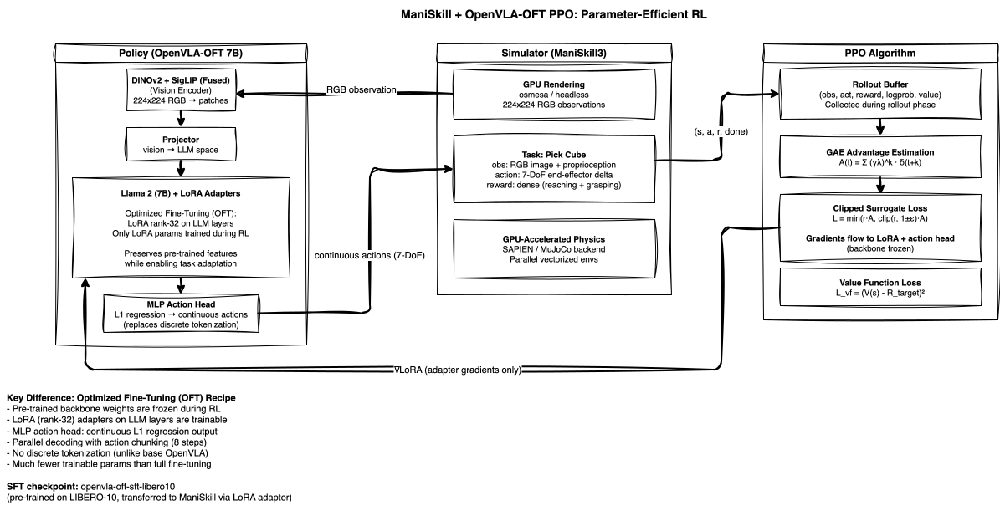
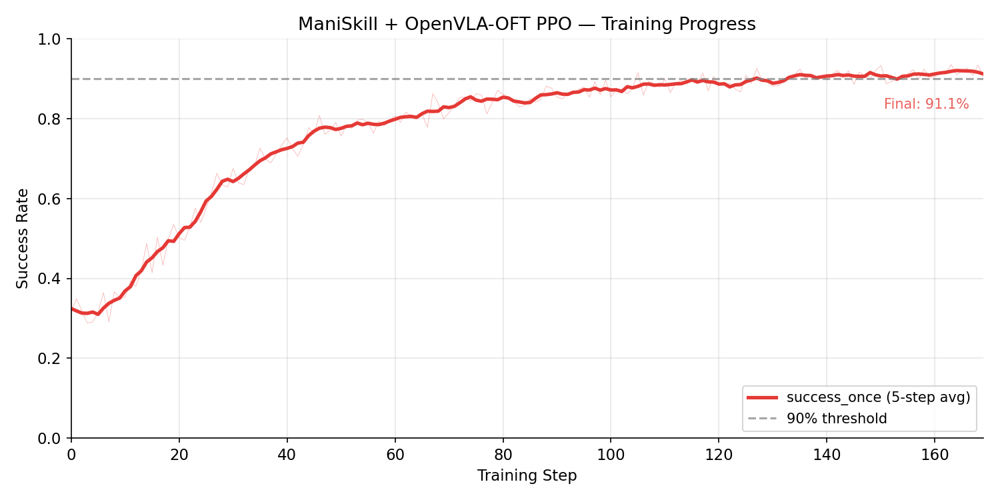

<!-- Copyright Amazon.com, Inc. or its affiliates. All Rights Reserved. -->
<!-- SPDX-License-Identifier: MIT-0 -->

# ManiSkill + OpenVLA-OFT PPO on EKS

Single-node RL (reinforcement learning) fine-tuning of [OpenVLA-OFT](https://github.com/moojink/openvla-oft) (Optimized Fine-Tuning variant with continuous actions and LoRA (Low-Rank Adaptation)) on ManiSkill3 robotic manipulation tasks using Proximal Policy Optimization (PPO).

> **Validated on EKS.** This deployment was run end-to-end on Amazon EKS; PPO fine-tuning converged to a **92.0% peak success rate**. Use it as a starting point for your own training runs (see [Results](#results) for the reference run).

<video src="assets/maniskill_openvlaoft_success.mp4" width="720" autoplay loop muted></video>

*Parallel ManiSkill3 evaluation rollouts from the trained OpenVLA-OFT policy. Each tile shows the robot arm completing a pick-and-place task using continuous end-effector control via the MLP action head with LoRA adapters.*

## Overview

| Property | Value |
|----------|-------|
| **Model** | OpenVLA-OFT 7B (LoRA adapters + MLP (Multi-Layer Perceptron) action head on frozen backbone) |
| **Algorithm** | PPO (Proximal Policy Optimization) |
| **Environment** | ManiSkill3 (GPU-accelerated sim) |
| **Hardware** | 1x p5en.48xlarge (8x H200 141GB) |
| **EFA** | 4x EFA (Elastic Fabric Adapter) adapters (for future multi-node scale-out) |
| **Config** | `maniskill_ppo_openvlaoft` |
| **SFT Checkpoint** | `RLinf/Openvla-oft-SFT-libero10-trajall` |

## How It Works

### OpenVLA-OFT: Parameter-Efficient Adaptation

OpenVLA-OFT modifies the standard OpenVLA architecture in two key ways. First, it replaces the discrete action tokenization (256-bin quantization) with an MLP action head that directly outputs continuous real-valued end-effector commands via L1 regression. Second, it applies LoRA (Low-Rank Adaptation, rank-32) to the LLM (Large Language Model) backbone layers. During RL training, only the LoRA adapter weights and the action head are updated while the pre-trained backbone remains frozen.

The "OFT" in OpenVLA-OFT stands for "Optimized Fine-Tuning" — a recipe combining parallel decoding, action chunking, continuous actions, and L1 regression. This is parameter-efficient and prevents catastrophic forgetting while enabling meaningful task adaptation, making RL fine-tuning more stable compared to full-parameter updates on a 7B model.

### PPO with Frozen Backbone

The PPO loop is structurally identical to the OpenVLA example, but gradients flow only through the LoRA adapters and the MLP action head. This has two practical benefits: significantly fewer trainable parameters (reducing GPU (Graphics Processing Unit) memory for optimizer states) and more stable training dynamics since the pre-trained representations are preserved by construction.

The SFT (Supervised Fine-Tuning) checkpoint (`openvla-oft-sft-libero10`) was pre-trained with LoRA on the full LIBERO-10 task suite using the OFT recipe. A separate LoRA adapter (`RLinf-OpenVLAOFT-ManiSkill-Base-Lora`) bridges the domain gap between LIBERO and ManiSkill3. PPO then fine-tunes the policy for the specific ManiSkill3 target task using 128 parallel GPU-accelerated environments for high-throughput data collection.

## Architecture

### Infrastructure


The infrastructure is shared across all three PPO examples. A single p5en.48xlarge node is provisioned by Karpenter when the training Job is submitted. The pod runs all RL components colocated on 8 H200 GPUs, with FSx for Lustre providing shared access to model weights and checkpoints. This example uses the same **split GPU placement** as vanilla OpenVLA (actor on GPUs 0-7, environments on 0-3, rollout on 4-7), but loads an additional artifact from FSx at startup: a LoRA adapter (`rlinf-openvlaoft-maniskill-base-lora`) that bridges the domain gap between the LIBERO (Lifelong Embodied Robot Operation)-trained SFT checkpoint and ManiSkill3. The full 128-environment configuration is critical for OFT — earlier experiments with the quickstart config (8 environments) showed flat learning at 12% success because the sparse reward signal was insufficient for PPO to overcome the larger domain gap. The 64Gi `/dev/shm` shared memory allocation supports high-bandwidth data transfer between GPU-accelerated environment workers and the training process.

### Model & Algorithm



The model diagram shows the complete OFT adaptation pattern. RGB observations from ManiSkill3 flow through the dual vision encoder (DINOv2 ViT-L/14 + SigLIP ViT-SO400M, fused) into 256 patch embeddings, which a projector maps into the Llama 2 7B embedding space. Unlike base OpenVLA which generates discrete action tokens autoregressively, OFT uses **parallel decoding with action chunking** — the LLM produces all action positions simultaneously through a single forward pass, and an MLP action head (2-layer ResNet with L1 regression) maps the hidden states directly to continuous 7-DoF end-effector commands. During RL, the pre-trained Llama 2 backbone weights are frozen — only the LoRA adapter parameters (rank-32, applied to all linear layers) and the MLP action head receive gradient updates from PPO's clipped surrogate objective. This preserves the pre-trained vision-language features while enabling task-specific policy improvement with significantly fewer trainable parameters.

## Results



| Metric | Value |
|--------|-------|
| **Peak success_once** | 92.0% (step 164) |
| **Final success_once** | 91.1% (step 169) |
| **Steps trained** | 169 |
| **Step time** | ~230s |
| **Total training time** | ~10.8 hours |
| **Placement** | Split: actor 0-7, env 0-3, rollout 4-7 |
| **Environments** | 128 parallel (GPU-accelerated) |
| **Global batch size** | 640 |

The OFT model starts at approximately 32% success — significantly lower than vanilla OpenVLA (58%) because the base checkpoint was SFT'd on LIBERO (a different environment) with a LoRA adapter bridging to ManiSkill. Despite this domain gap, PPO with sufficient parallelism (128 envs) pushes success rates above 90% within 130 steps. The large batch size is critical: earlier experiments with only 8 environments (quickstart config) showed flat learning at 12%, while the full 128-environment config provides enough positive reward signal for PPO to learn from.

To regenerate this chart from your own training run:

```bash
python examples/scripts/plot_training_curve.py \
    --logdir /fsx/checkpoints/<experiment>/tensorboard \
    --metric success_once \
    --output examples/maniskill-openvlaoft-ppo/assets/training_curve.png \
    --title "ManiSkill + OpenVLA-OFT PPO — Training Progress"
```

## Reproduce

### Prerequisites

- EKS (Elastic Kubernetes Service) cluster with GPU node group (p5en.48xlarge)
- FSx for Lustre with pre-staged model weights (`openvla-oft-sft-libero10`)
- Container image built and pushed to ECR (Elastic Container Registry)

### 1. Download Model Weights

```bash
export NAMESPACE=rlinf  # or your namespace
envsubst '${NAMESPACE}' < examples/maniskill-openvlaoft-ppo/manifests/model-download.yaml | kubectl apply -f -
kubectl logs -f job/model-download-maniskill-openvlaoft -n $NAMESPACE
```

### 2. Launch Training

```bash
export ECR_URI=$(terraform -chdir=infrastructure/build output -raw ecr_repository_url)
export NAMESPACE=rlinf
envsubst < examples/maniskill-openvlaoft-ppo/manifests/maniskill-openvlaoft-ppo.yaml | kubectl apply -f -
```

### 3. Monitor

```bash
kubectl logs -f job/rlinf-maniskill-openvlaoft -n $NAMESPACE
```

## Regenerating the Showcase Video

The showcase video at the top of this README can be regenerated from any training checkpoint using the shared script:

```bash
export ECR_URI=$(terraform -chdir=infrastructure/build output -raw ecr_repository_url)
export NAMESPACE=rlinf
export S3_BUCKET=$(terraform -chdir=infrastructure/storage output -raw fsx_s3_bucket)
export CKPT_PATH=/fsx/checkpoints/<run>/checkpoints/global_step_<N>/actor/model_state_dict/full_weights.pt
export LORA_PATH=/fsx/checkpoints/<run>/checkpoints/global_step_<N>/actor/model_state_dict/lora_weights/

./examples/scripts/generate-showcase-video.sh maniskill-openvlaoft-ppo
```

The script deploys `manifests/eval-video.yaml` as a Kubernetes Job, waits for completion, downloads the raw video from S3, then **strips duplicate frames** (keeping every 8th) via ffmpeg to produce smooth playback. The OFT model uses `num_action_chunks=8`, meaning 7 out of every 8 rendered frames are duplicates — the script handles this automatically based on the `rlinf.io/num-action-chunks` annotation in the manifest.

The final result is placed in `assets/maniskill_openvlaoft_success.mp4` (~173 frames, 5fps, 34.6s, 3584x512).

**Requirements**: `kubectl`, `aws` CLI, `envsubst`, and `ffmpeg` (required for frame stripping). The cluster must have a GPU node available and model weights + LoRA adapter pre-staged on FSx.

## File Layout

```
examples/maniskill-openvlaoft-ppo/
├── README.md               # This file
├── assets/                 # Training curves and showcase videos
│   ├── training_curve.png
│   └── maniskill_openvlaoft_success.mp4
├── diagrams/
│   ├── model-openvlaoft-ppo.drawio     # Model/algorithm diagram
│   └── model-openvlaoft-ppo.drawio.svg
├── manifests/
│   ├── eval-video.yaml              # Showcase video eval Job
│   ├── model-download.yaml              # Model weight staging
│   └── maniskill-openvlaoft-ppo.yaml    # Training Job
└── video_artifacts/        # Raw eval dumps (gitignored)
```
