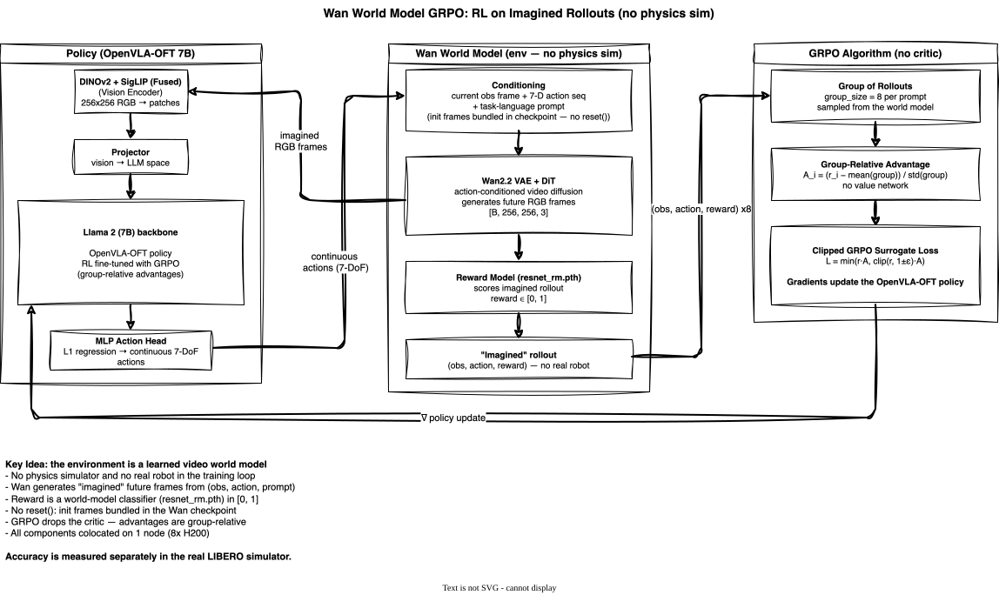

<!-- Copyright Amazon.com, Inc. or its affiliates. All Rights Reserved. -->
<!-- SPDX-License-Identifier: MIT-0 -->

# Wan World Model GRPO (OpenVLA-OFT on LIBERO) on EKS

Single-node RL (reinforcement learning) fine-tuning of [OpenVLA-OFT](https://github.com/moojink/openvla-oft) with **GRPO (Group Relative Policy Optimization)**, where the training environment is the **Wan action-conditioned video world model** — the policy is optimized on "imagined" rollouts generated by Wan, with **no physics simulator and no real robot in the training loop**. Evaluation is run in the real LIBERO (Lifelong Embodied Robot Operation) simulator for ground-truth task success.

> **Validated on EKS.** This deployment was run end-to-end on Amazon EKS (1x p5en.48xlarge, 8x H200): a short **2-step GRPO run with evaluation enabled completed successfully** (Job `SUCCEEDED`, ~35 min), exercising the full pipeline — OpenVLA-OFT policy load, Wan world-model environment init, GRPO rollout generation through the world model (16 rollout epochs/step, all 8 GPUs at ~100% util), the GRPO actor update, and **evaluation in the real LIBERO simulator** (64 episodes, `eval/success_once ≈ 0.48`). This validates the *machinery end-to-end, including the real-sim eval path* — it is not a converged-accuracy claim; a 2-step run is a smoke test (see [Validation](#validation)). For real accuracy, train for many more steps. Use it as a starting point for your own training runs.

## Overview

| Property | Value |
|----------|-------|
| **Model** | OpenVLA-OFT 7B (continuous action head, RL fine-tuned) |
| **Algorithm** | GRPO (Group Relative Policy Optimization), `group_size` 8 |
| **Training env** | Wan world model (LIBERO-Spatial), `env_type: wan_wm` — **no physics sim** |
| **Eval env** | Real LIBERO-Spatial simulator (ground-truth `success_once`) |
| **World model** | `RLinf/RLinf-Wan-LIBERO-Spatial` (Wan2.2 VAE + DiT + `resnet_rm.pth` reward model) |
| **Hardware** | 1x p5en.48xlarge (8x H200 141GB) |
| **EFA** | 4x EFA (Elastic Fabric Adapter) adapters (for future multi-node scale-out) |
| **Config** | `wan_libero_spatial_grpo_openvlaoft` |
| **SFT Checkpoint** | `Haozhan72/Openvla-oft-SFT-libero-spatial-traj1` |

## How It Works

### Wan: A Video World Model as the RL Environment

The defining idea of this example is that the environment is a **learned video world model**, not a physics simulator or a real robot. `RLinf/RLinf-Wan-LIBERO-Spatial` is a Wan2.2-based action-conditioned video diffusion model: given the current observation frame, a 7-D action sequence (tokenized), and a natural-language task prompt, it **generates the future RGB frames** `[B, 256, 256, 3]` that would result from taking those actions. The policy is trained entirely on these "imagined" rollouts.

Unlike a physics simulator, the Wan world model has **no `reset()`**: there is no engine to re-initialize. Instead, initialization frames are bundled inside the Wan checkpoint (`.../dataset/`), so **no separate dataset download is required for training**. The training **reward** is not a hand-coded sim reward either — it is the output of a world-model reward classifier (`resnet_rm.pth`) in `[0, 1]` that scores how well an imagined rollout completes the task.

This makes the example a compact demonstration of "RL on imagined rollouts": the same world-model brand story as DreamZero, but closing the RL loop instead of doing SFT.

### GRPO with Group-Relative Advantages

GRPO (Group Relative Policy Optimization) replaces PPO's learned value/critic network with a **group-relative baseline**. For each prompt, the policy samples a *group* of `group_size` (here 8) rollouts; each rollout's advantage is computed by normalizing its reward against the mean and standard deviation of its group. This removes the critic entirely — there is no separate value function to train — which is well-suited to a world-model environment where rewards come from the `resnet_rm.pth` classifier rather than a dense engineered signal.

The clipped GRPO surrogate objective then updates the OpenVLA-OFT policy from these group-normalized advantages. All RL components (actor, env, rollout) are **colocated on one node's 8 GPUs** (`component_placement: all`), so a single p5en.48xlarge runs the entire loop.

### Train in Imagination, Evaluate in Reality

Because the world model is only an *approximation* of LIBERO physics, task accuracy is measured in the **real LIBERO-Spatial simulator**, not in Wan. Training happens in imagination (fast, no sim); evaluation grounds the learned policy against the actual simulator's `success_once`, keeping the reported accuracy honest.

## Architecture

### Infrastructure


The infrastructure is shared with the single-node PPO examples. Karpenter provisions one p5en.48xlarge node when the training Job is submitted, and the pod runs all RL components colocated on 8 H200 GPUs with FSx for Lustre providing shared access to the Wan world-model checkpoint, the OpenVLA-OFT SFT policy, and checkpoints. Because the "environment" is the Wan world model running on the GPUs (not a CPU MuJoCo sim), this example uses **combined GPU placement** — actor, environment (world model), and rollout all share GPUs 0-7. The 64Gi `/dev/shm` allocation supports high-bandwidth transfer between the world-model rollout generation and the GRPO trainer. Unlike the LIBERO examples, no LIBERO dataset is staged for *training* (init frames ship inside the Wan checkpoint); the LIBERO simulator assets are only needed for the ground-truth evaluation pass.

### Model & Algorithm



The model diagram shows the GRPO loop closed through the Wan world model. RGB observations flow through the OpenVLA-OFT policy (dual DINOv2 + SigLIP vision encoder → projector → Llama 2 7B backbone → MLP action head) to produce a 7-DoF continuous action sequence. Instead of stepping a physics simulator, that action sequence conditions the **Wan video world model** (Wan2.2 VAE + DiT), which generates the imagined future frames; the `resnet_rm.pth` reward model scores each imagined rollout in `[0, 1]`. GRPO samples a group of 8 rollouts per prompt, computes group-relative (mean/std-normalized) advantages with **no critic network**, and updates the OpenVLA-OFT policy through the clipped GRPO surrogate objective. The trained policy is then evaluated separately in the real LIBERO-Spatial simulator.

## Validation

> **Validated on EKS (training + real-simulator eval).** A short 2-step GRPO run of
> `wan_libero_spatial_grpo_openvlaoft` with evaluation enabled completed end-to-end
> on 1x p5en.48xlarge (8x H200) and the Job reached `SUCCEEDED` (~35 min). It
> exercised the **full pipeline**: OpenVLA-OFT policy load → Wan world-model
> environment init → GRPO rollout generation through the world model (16 rollout
> epochs/step, all 8 GPUs at ~100% util) → GRPO actor update → **evaluation in the
> real LIBERO-Spatial simulator**. The eval pass (64 real-sim episodes) reported
> `eval/success_once ≈ 0.48`, and per-step GRPO metric tables printed cleanly
> (`actor/grad_norm`, `actor/approx_kl`, `actor/policy_loss`, etc.).
>
> This validates the **machinery end-to-end, including the real-sim eval path** — it
> is **not** a converged-accuracy claim. A 2-step run is a smoke test: the ~0.48
> eval number is near the untrained SFT baseline (RLinf reports 61.2% for the LoRA
> base on Spatial; see the reference table below) and should not be read as a
> trained result. For real accuracy, raise `runner.max_steps` and train for many
> more steps. No numbers here are fabricated — they are from this run's logs.

Notes for reproduction:
- The training image installs the Wan diffusion library `diffsynth` (diffsynth-studio) into the `openvla-oft` venv as part of the unified image build — no manual setup is needed.
- The training manifest sets `env.train.enable_offload=False`. The Wan env's offload method isn't detected through the env-wrapper stack, so the upstream default (`enable_offload=True`) trips an assertion at env init; disabling env offload runs fine on p5en H200 (141GB). Revisit for smaller GPUs.
- **Evaluation is disabled by default** in the shipped config (`runner.val_check_interval=-1`). To evaluate in the real LIBERO simulator, append a positive interval to `HYDRA_OVERRIDES`, e.g. `runner.val_check_interval=<N>` (`save_interval` must be `<0` or divisible by it). The eval uses the `env/eval: libero_spatial` backend — a real MuJoCo sim, **not** the Wan world model — so the training manifest also sets `LIBERO_DATASET_DIR=/fsx/datasets/libero` and `ROBOT_PLATFORM=LIBERO` (inert while eval is off). For a faster smoke eval, override `env.eval.total_num_envs` (must be divisible by the 8-GPU env world size; the run above used `64`). The eval needs the LIBERO simulator dataset at `/fsx/datasets/libero`; LIBERO auto-downloads it on first use, or you can pre-stage it (see the `rlinf-dataset-preparation` skill).

**Accuracy reference (RLinf's published results, not this run).** For a sense of what a *full* GRPO run achieves, RLinf reports LIBERO success rates (evaluated in the real simulator) for OpenVLA-OFT trained with GRPO using a **frozen** Wan world model as the environment ([RLinf docs](https://rlinf.readthedocs.io/en/latest/rst_source/examples/embodied/wan.html)):

| Model | Spatial | Object | Goal |
|-------|---------|--------|------|
| OpenVLA-OFT (LoRA base, before RL) | 61.2% | 36.7% | 48.2% |
| OpenVLA-OFT (GRPO with Wan as world model) | **77.5%** | **77.9%** | **60.1%** |

These are RLinf's numbers for the recipe this example deploys — a starting-point reference for what a converged run looks like, not a claim about the 2-step smoke test above.

## Reproduce

### Prerequisites

- EKS (Elastic Kubernetes Service) cluster with a GPU node group (p5en.48xlarge) provisionable by Karpenter
- FSx for Lustre PVC `fsx-claim` bound at `/fsx` and the `training-sa` ServiceAccount (both created by `infrastructure/deploy.sh`)
- Container image built and pushed to ECR (Elastic Container Registry) — the unified image covers this example (`VENV_NAME=openvla-oft`)
- (Optional) a Hugging Face token to avoid anonymous per-IP rate limits — see below

A Hugging Face token is optional for these public repos but **recommended**: create a `hf-token` Secret (`kubectl create secret generic hf-token --from-literal=HF_TOKEN=hf_...`) so the download Job authenticates. The Job runs anonymously if the Secret is absent.

### 1. Download Model Weights

Stages the Wan world model + OpenVLA-OFT SFT policy to FSx.

```bash
export NAMESPACE=rlinf  # or your namespace
envsubst '${NAMESPACE}' < examples/wan-openvlaoft-grpo/manifests/model-download.yaml | kubectl apply -f -
kubectl logs -f job/model-download-wan-openvlaoft -n $NAMESPACE
```

### 2. Launch Training

```bash
export ECR_URI=$(terraform -chdir=infrastructure/build output -raw ecr_repository_url)
export NAMESPACE=rlinf
envsubst '${ECR_URI} ${NAMESPACE}' < examples/wan-openvlaoft-grpo/manifests/wan-openvlaoft-grpo.yaml | kubectl apply -f -
```

For a short smoke run, append `runner.max_steps=2` to the `HYDRA_OVERRIDES` value in the training manifest. Keep the shipped config's batch math intact (do not resize `total_num_envs`).

### 3. Monitor

```bash
kubectl logs -f job/rlinf-wan-openvlaoft-grpo -n $NAMESPACE
```

Watch for the world-model rollout generation, the per-step GRPO metric tables, and `env/success_once`.

## File Layout

```
examples/wan-openvlaoft-grpo/
├── README.md                       # This file
├── diagrams/
│   ├── model-wan-grpo.drawio       # Model/algorithm diagram (GRPO loop via Wan world model)
│   └── model-wan-grpo.drawio.svg
└── manifests/
    ├── model-download.yaml         # Stage RLinf-Wan-LIBERO-Spatial + OpenVLA-OFT policy
    └── wan-openvlaoft-grpo.yaml    # Single-node 8-GPU GRPO training Job
```
