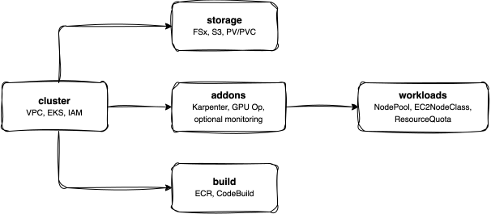

<!-- Copyright Amazon.com, Inc. or its affiliates. All Rights Reserved. -->
<!-- SPDX-License-Identifier: MIT-0 -->

# Infrastructure

Layered Terraform infrastructure for deploying GPU (Graphics Processing Unit)-accelerated RL (reinforcement learning) training on Amazon EKS (Elastic Kubernetes Service).

## Architecture



## Layers

Infrastructure is deployed in 5 independent layers, each with its own Terraform state. Layers have explicit upstream dependencies -- outputs from earlier layers feed as variables into later ones.

```
cluster -> storage -> addons -> workloads -> build
```

| Layer | Purpose | Key Resources |
|-------|---------|---------------|
| **cluster** | Foundation | VPC (Virtual Private Cloud), EKS cluster, system node group, IAM (Identity and Access Management) roles, OIDC (OpenID Connect), EFA (Elastic Fabric Adapter) security groups |
| **storage** | Data | FSx for Lustre, S3 bucket, DRA (Data Repository Association) association, PV/PVC (PersistentVolume/PersistentVolumeClaim) |
| **addons** | Operators | Karpenter, NVIDIA GPU Operator, EFA device plugin (+ optional: Prometheus, MLflow, KubeRay, MPI Operator) |
| **workloads** | Scheduling | Karpenter NodePool, EC2NodeClass, ResourceQuota, LimitRange |
| **build** | CI (Continuous Integration) | ECR (Elastic Container Registry) repository, CodeBuild project (two-stage container build) |

## Usage

All layers are orchestrated by `deploy.sh`, which runs `terraform init` and passes cross-layer variables automatically:

```bash
# Plan all layers (dry run)
./infrastructure/deploy.sh --action plan --layer all

# Apply all layers in order (~20 min)
./infrastructure/deploy.sh --action apply --layer all

# Apply a single layer
./infrastructure/deploy.sh --action apply --layer addons

# Destroy all layers (reverse order)
./infrastructure/deploy.sh --action destroy --layer all --auto-approve

# Use a named profile (cluster layer only, loads cluster/profiles/<name>.tfvars)
./infrastructure/deploy.sh --action plan --layer cluster --profile g6-validation
```

| Flag | Values | Default | Notes |
|------|--------|---------|-------|
| `--action` | `plan`, `apply`, `destroy` | `plan` | Terraform action to execute |
| `--layer` | `cluster`, `storage`, `addons`, `workloads`, `build`, `all` | `all` | Target layer(s) |
| `--profile` | Profile name | (none) | Loads `cluster/profiles/<name>.tfvars`; cluster layer only |
| `--auto-approve` | (flag) | off | Skips interactive confirmation on apply/destroy |

The script uses `set -euo pipefail` — it exits immediately on any failure. Destroy with `--layer all` reverses the apply order (build → workloads → addons → storage → cluster).

After apply, configure kubectl:
```bash
$(terraform -chdir=infrastructure/cluster output -raw configure_kubectl)
```

## Layer Details

### cluster/

VPC with public/private subnets, EKS cluster with managed system node group, IAM roles (Pod Identity for CSI (Container Storage Interface) drivers), and EFA security group rules (self-referencing ingress + egress).

Key outputs: `cluster_name`, `cluster_endpoint`, `cluster_certificate_authority_data`, `vpc_id`, `private_subnets`, `node_security_group_id`, `oidc_provider_arn`, `target_az`, `region`.

### storage/

FSx for Lustre (PERSISTENT_2, SSD (Solid-State Drive)) with S3 Data Repository Association for auto-import/export. Creates PersistentVolume and PersistentVolumeClaim for pod mounting at `/fsx`.

Key outputs: `fsx_filesystem_id`, `fsx_mount_name`, `fsx_dns_name`, `s3_bucket_name`, `s3_bucket_arn`.

### addons/

**Required** (always deployed): Karpenter (GPU node provisioning), NVIDIA GPU Operator (driver management, device plugin, GPU Feature Discovery), EFA device plugin.

**Optional** (disabled by default):

| Addon | Variable | Purpose |
|-------|----------|---------|
| kube-prometheus-stack | `enable_monitoring` | Prometheus + Grafana for GPU/cluster metrics |
| MLflow | `enable_mlflow` | Experiment tracking server on FSx |
| MPI Operator | `enable_mpi_operator` | MPIJob CRD (Custom Resource Definition) for NCCL (NVIDIA Collective Communications Library) bandwidth tests |
| KubeRay | `enable_kuberay` | Ray cluster management via CRDs (future: disaggregated RL) |

Enable optional addons in `infrastructure/addons/terraform.tfvars`:

```hcl
enable_mlflow     = true
enable_monitoring = true
```

#### MLflow Experiment Tracking

RLinf supports [multiple logger backends](https://rlinf.readthedocs.io/en/latest/rst_source/blog/compare_with_verl.html#training-control-parameters) including MLflow. When `enable_mlflow = true`, the addons layer deploys an MLflow tracking server (SQLite on FSx, UI on port 5000).

To use it, add the following env vars to your training manifest:

```yaml
- name: MLFLOW_TRACKING_URI
  value: "http://mlflow.rlinf.svc.cluster.local"
```

And configure the RLinf logger in your Hydra overrides:

```
trainer.logger='["console","tensorboard","mlflow"]'
```

TensorBoard remains the default logger (always active). MLflow adds experiment comparison, run metadata, and artifact tracking on top.

Access the MLflow UI: `kubectl port-forward svc/mlflow -n rlinf 5000:80`

Key outputs: `karpenter_installed`, `gpu_operator_namespace`.

### workloads/

Karpenter NodePool and EC2NodeClass definitions for GPU instances. ResourceQuota and LimitRange for namespace-level guardrails.

Configuration (via `infrastructure/workloads/terraform.tfvars`):

| Variable | Default | Purpose |
|----------|---------|---------|
| `gpu_instance_types` | `[]` (use families) | Explicit instance types; set for Capacity Blocks |
| `gpu_instance_families` | `["g6", "g6e", "g5"]` | Families Karpenter selects from when types is empty |
| `capacity_type` | `["on-demand"]` | `["reserved", "on-demand"]` for Capacity Blocks with fallback |
| `capacity_reservation_selector` | `[]` | Reservation ID or tags; required when using `reserved` |
| `gpu_limit` | `8` | Max total GPUs across all nodes (cost guard) |
| `target_az` | `""` (from cluster layer) | Passed automatically via deploy.sh |

Key outputs: `nodepool_name`, `ec2nodeclass_name`.

### build/

ECR repository for training container images. CodeBuild project configured for two-stage builds (upstream RLinf + EFA overlay). S3 bucket for CodeBuild source upload.

Key outputs: `ecr_repository_url`, `codebuild_project_name`, `codebuild_source_bucket`.

## Other Contents

| Path | Purpose |
|------|---------|
| `deploy.sh` | Layer orchestration script |
| `manifests/` | Infrastructure validation manifests (see below) |

### Validation Manifests (`manifests/`)

| Manifest | Kind | Purpose | Used In |
|----------|------|---------|---------|
| `smoke-test.yaml` | Job | GPU, EFA, CUDA, FSx smoke test | L0 |
| `container-test.yaml` | Job + ConfigMap | 10-test container validation (multi-venv, EFA libs, CUDA) | L2 |
| `nccl-tests-mpijob.yaml` | MPIJob | NCCL/EFA bandwidth threshold test | L3 |
| `topology-labeler.yaml` | DaemonSet + RBAC | Labels GPU nodes with EC2 network topology for topology-aware scheduling | Optional (multi-node) |
| `training-statefulset.yaml` | StatefulSet | Multi-node training (L6 validation) | L6 |
| `training-service.yaml` | Service (headless) | DNS rendezvous for multi-node training | L6 |

Deploy validation manifests with `envsubst` (requires `ECR_URI`):
```bash
export ECR_URI=$(terraform -chdir=infrastructure/build output -raw ecr_repository_url)
envsubst < infrastructure/manifests/container-test.yaml | kubectl apply -f -
```

## Terraform State

Each layer stores state in S3 with a separate key:

```
s3://<state-bucket>/
├── cluster/terraform.tfstate
├── storage/terraform.tfstate
├── addons/terraform.tfstate
├── workloads/terraform.tfstate
└── build/terraform.tfstate
```

State bucket and region are hardcoded in each layer's `versions.tf` backend block. The state bucket must exist before first deploy (see [root README](../README.md#terraform-state-backend) for bootstrap instructions). State locking uses Terraform's native S3 lockfile (`use_lockfile = true`) — no DynamoDB table is required.

## Cross-Layer Dependencies

`deploy.sh` resolves cross-layer dependencies by reading `terraform output` from upstream layers and passing values as `-var` flags. If an upstream output is empty or missing, the variable is silently skipped.

| Layer | Reads From |
|-------|-----------|
| storage | cluster (`cluster_name`, `cluster_endpoint`, `cluster_certificate_authority_data`, `vpc_id`, `node_security_group_id`, `target_subnet_ids`, `region`) |
| addons | cluster (`cluster_name`, `cluster_endpoint`, `cluster_certificate_authority_data`, `node_security_group_id`, `region`, `mlflow_iam_role_arn`, `mlflow_s3_bucket`) |
| workloads | cluster (`cluster_name`, `cluster_endpoint`, `cluster_certificate_authority_data`, `node_security_group_id`, `target_az`, `region`) |
| build | cluster (`region`) |

If you change an output in the cluster layer, all downstream layers need a re-plan. Storage, workloads, and build are leaf layers with no downstream dependents.
